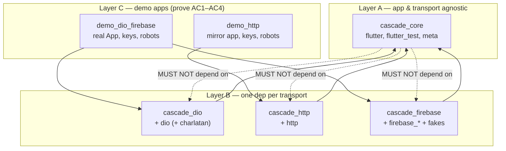

# Universal Flutter Acceptance-Test Harness

> Source of truth: `teroxx/front_end/docs/test_harness_requirements.md`
> (R1.1–R7.3, AC1–AC6, D1–D5). Prior art read in full:
> `teroxx/front_end/test/support/test_app.dart` (1020 LOC) + robots + stub defaults.
> This brainstorm was produced **non-interactively**; every choice the skill would
> normally have prompted for is recorded under **Auto-resolved Assumptions**.

## What We're Building

A reusable, app-agnostic **system-test harness** for Flutter apps, extracted from
the Teroxx `TestApp` prototype and generalized. A test pumps the *real* `App`
widget with all real wiring (interceptors, serialization, error mapping, blocs),
and fakes only the outermost I/O boundary — HTTP transport, Firebase SDKs — so the
system under test is "UI → real app → real transport plumbing → faked transport →
back to UI". Configuration is a synchronous Dart-cascade builder; the UI is driven
by `Key`s through BDD robots.

It ships as a **monorepo of packages** living inside `cascade_test`: a Layer A core
(app/transport-agnostic), Layer B transport adapters (`*_dio`, `*_http`,
`*_firebase`), and Layer C demo apps that prove the acceptance criteria. The
package graph itself is the enforcement mechanism for AC5 (no app/dio/http/firebase
imports leak into Layer A). Terminal state for this pipeline is a **local feature
branch only** — no publishing, no PR, no remote.

## Why This Approach

The single hardest constraint is **AC5: "No Layer A/B file imports app code,
`app_ui`, Firebase, dio, or http outside its designated adapter (enforced by
package dependency graph)."** The phrase *"enforced by package dependency graph"*
is decisive — it rules out a single-package design and drives the whole layout.

Three structural approaches were considered:

**A. Monorepo of packages via a Dart pub workspace** — *RECOMMENDED*

Separate packages for core, each adapter, and each demo. `cascade_core`'s
`pubspec.yaml` simply does not list dio/http/firebase, so a core file that tries to
`import 'package:dio/...'` fails analysis ("depend on it in your pubspec.yaml")
before a test ever runs. AC5 holds *by construction*, not by vigilance.

- Pros: AC5 enforced mechanically; adapters isolate their transport dep; matches
  the spec's Layer A/B/C wording 1:1; pub workspaces are SDK-native (Dart 3.12 has
  them) with one shared lockfile and one `dart pub get`.
- Cons: More directories; contributors must learn the workspace layout; all members
  share one resolved dependency set.
- Best when: a hard, machine-checkable module boundary is a first-class requirement
  — which is exactly AC5.

**B. Single package + import lints** — *rejected*

One package with a custom analyzer rule / `import_lint` forbidding dio/http/firebase
imports in `lib/src/core/`.

- Pros: simplest directory layout; no workspace tooling.
- Cons: a lint is **not** "a package dependency graph" (fails AC5 as written); the
  transport packages are all co-resident so nothing physically prevents a core file
  from importing them; weaker guarantee, easy to regress.

**C. Melos-managed monorepo** — *fallback only*

Same package split as A, but orchestrated by Melos.

- Pros: mature multi-package tooling, scripting, versioning.
- Cons: an extra tool + bootstrap step for zero benefit over SDK-native workspaces
  at this scale (YAGNI). Keep in reserve only if pub workspaces prove to have
  friction with Flutter + Firebase plugins.

Recommendation: **A (pub workspace monorepo)**, with C as a documented fallback.

## Package & Module Layout (the AC5-enforcing graph)

Proposed members under `cascade_test/packages/` (names are a planning detail, not
binding — see Assumptions). The existing root `cascade_test` package becomes the
**workspace root**.

**`cascade_core` (Layer A).** Depends only on `flutter`, `flutter_test`, `meta`.
Contents:

- `StubRegistry` + `Stub`, `BoundaryRequest`, `StubResolution`, matchers,
  `CallRecorder`, `MissingStubError` (fail-fast) — the transport-agnostic
  request/response model (R2).
- `TestHarnessBuilder` — the sync cascade builder holding the registry + a list of
  adapter-supplied "installers"; deferred to `build()` (R3).
- `WidgetTesterX` extension + `HarnessConfig` (button resolvers, text extractors)
  (R4).
- `Robot` base class (R5).
- Observability: boundary-call log, `BlocObserver` passthrough, `LoggingObserver`,
  `printOutStringKeys` (R7).

**`cascade_dio` / `cascade_http` / `cascade_firebase` (Layer B).** Each depends on
`cascade_core` **plus its one transport**. Each provides a thin *translator* from
its native transport request into `BoundaryRequest`, calls `registry.resolve(...)`,
and translates the `StubResolution` back — see Design Tensions §1.

**`demo_dio_firebase` + `demo_http` (Layer C).** Real (small) Flutter apps with
injectable boundaries, `*_keys.dart` files, `TestApp` wiring, fixtures, and robots.
These are the executable proof of AC1–AC4 and live in the harness repo per AC1/AC3.

Note: this **removes the "pure-Dart package" status of `cascade_test`** — Layer A
needs `flutter_test` for `WidgetTester`/`testWidgets`, so `cascade_core` (and thus
the workspace) gains a Flutter dependency. This is expected and called out in the
task; the plan must update the environment/pubspecs accordingly.

## Requirement-Group → Module Mapping

| Req group | Lands in | Concrete modules / responsibilities |
|---|---|---|
| **R1** Architecture / distribution / adoption | workspace + README | package split, pub workspace, git-dependency consumability, "make your app injectable" checklist (R1.3), incremental-adoption note (R1.4) |
| **R2** Stub model | `cascade_core` | `StubRegistry`, `Stub`, `BoundaryRequest`, `Matcher`s (exact default, opt-in prefix/pattern, query/body — R2.4), sequencing (R2.6), latency (R2.5), `CallRecorder` + `expectCalled*` (R2.7), `MissingStubError` fail-fast (R2.3). Adapters translate only. |
| **R3** Fluent/cascade API | `cascade_core` | `TestHarnessBuilder` — sync, side-effect-free until `build()` (R3.1–R3.2); **drop** the `FutureWidgetTesterX` chaining extension (R3.3/D5) |
| **R4** Key-based driving | `cascade_core` | `WidgetTesterX` verbs (R4.3) + `HarnessConfig` pluggable button resolvers & text extractors (R4.4); optional semantics finder (R4.5, deferred) |
| **R5** BDD robots | `cascade_core` (base) + Layer C (per-app) | `Robot` base holds tester + R4.3 verbs (R5.1); per-app robots compose domain verbs (R5.2); explicit `...IfPresent` (R5.3) |
| **R6** Firebase at the edge | `cascade_firebase` | Firestore/Auth/Storage **seeders** (R6.1); callable-as-route via faked `FirebaseFunctions` on the shared registry (R6.2); emulator adapter (R6.3, deferred); no Firebase types escape to core (R6.4) |
| **R7** Observability | `cascade_core` | boundary call log (R7.1), observer hook + `LoggingObserver` (R7.2), `printOutStringKeys` (R7.3) |

## Key Design Tensions & Resolutions

### 1. One declarative registry over three unlike faking mechanisms (R2.1 vs R2.2)

The core tension. The spec wants "one declarative model for all backends" (R2.1)
but the three backends fake at genuinely different levels:

- **dio** → swap `dio.httpClientAdapter` for a fake `HttpClientAdapter` whose
  `fetch(RequestOptions, …) → Future<ResponseBody>` is intercepted. Pure
  request→response. (This is what `charlatan` does.)
- **package:http** → inject a `MockClient(MockClientHandler)` whose handler is
  `Future<Response> Function(Request)`. Also pure request→response.
- **Firebase** → *not a transport*. Firestore/Auth/Storage are **stateful stores**
  faked by `fake_cloud_firestore` / `firebase_auth_mocks` / `firebase_storage_mocks`.
  Callable Functions have no official fake, so the injected `FirebaseFunctions` is
  faked and the callable *name* is treated as a route.

**Resolution — split into two cooperating abstractions, one fluent surface:**

- A **request/response `StubRegistry`** in core, keyed by an abstract
  `BoundaryRequest {method, endpoint, body, query}`, carrying *all* of R2.3–R2.7
  (matching, sequencing, latency, recording, fail-fast). HTTP routes **and**
  Firebase callables both flow through it — the spec confirms this split: R6.2
  explicitly applies R2.3–R2.7 to callables, while R6.1 (Firestore/Auth) describes
  only declarative *seeding*.
- A separate **`Seeder`** concept (owned by `cascade_firebase`) for stateful stores:
  `withCollection`, `withDocument`, `withSignedInUser`, `withSignedOutUser`. Seeds
  are initial state, not stubbed calls; they do **not** go through fail-fast or call
  recording (a read of an unseeded collection legitimately returns empty).

The `TestHarnessBuilder` presents both behind one cascade surface, so the user sees
"one declarative model", but Layer A only defines the registry + a `TransportInstaller`
interface; adapters implement the translation. This is the seam that makes AC3 work.

### 2. Transport-level fidelity — *do not* reconstruct app exceptions (R2.2 / D4)

The prior-art `TestApp` mocks the `ApiClient` **wrapper** (`MockApiClient extends
Mock implements ApiClient`) and *reconstructs* app errors inside stubs —
`throw ApiClientException.fromDioError(...)` and a magic `250` "noContent" sentinel
(`test_app.dart:499`, `:512`). The spec explicitly forbids both. The adapter must
return a transport-shaped response (a dio `ResponseBody`/`Response` or http
`Response`) carrying the status code, and let the app's **real** interceptors and
error mapping run. Concretely: a stubbed 403 becomes a real `ResponseBody(statusCode:
403)`, dio raises its own `DioException`, and the app's production
`ApiClientException.fromDioError` executes as the system under test — never the
harness. This is the whole point of D4 and the reason the wrapper-level prototype is
being replaced.

### 3. AC5 enforcement is *structural*, not procedural

Covered in "Why This Approach": AC5's "package dependency graph" wording forces the
monorepo. The core package's pubspec is the enforcement — omit dio/http/firebase and
the analyzer blocks any stray import. A verification step (e.g. a tiny CI-independent
script or an analyzer run over `cascade_core`) can assert zero forbidden imports, but
the *guarantee* comes from the graph, not the check.

### 4. AC3 portability — "zero changes in Layer A or the test's robot code"

For the http demo to pass the *same-shaped* test as the dio demo with only Layer B/C
swapped, two things must hold: (a) the HTTP builder verbs (`withGet`, `withPost`,
`withCalled*`) live in **core** and operate on the registry — identical across
adapters; only the *installer* (which fake transport is created and injected) differs;
(b) robot/test bodies touch only keys + `WidgetTesterX`, never transport types, so
they are portable by nature. The literal "same robot code" is achieved by making the
http demo a **mirror** of the dio demo's screens/keys, so the robot ports verbatim.

### 5. Sequencing (R2.6) vs "later registrations override" (R2.4)

These need one coherent data model. Proposed: a `Stub` owns an *ordered list* of
responses; a bare `withGet(...)` is a one-element list; `withGetSequence([...])`
supplies many (403 then 200). Re-registering the same `(method, endpoint, matcher)`
**replaces** the earlier stub (so per-test overrides beat Layer C defaults, R2.4),
rather than appending to its sequence. Overriding-vs-sequencing must be two distinct
builder calls to stay unambiguous.

### 6. Latency, fake clock, and deterministic loading states (R2.5)

R2.5 wants a default ~100ms artificial latency so loading states render and can be
asserted. But the prior-art robots reveal how fiddly this is: `auth_robot.dart` uses
manual 20- and 40-iteration `pump()` loops and explicitly avoids `pumpAndSettle`
because the real app has repeating timers (a 5-minute event-bus timer). The harness's
`pumpThroughAnimations` double-pumps a large duration. Reconciling per-stub latency,
`pump(duration)` stepping, and real app timers into *deterministic* loading-state
assertions is a genuine design risk (see Risks).

## Demo Apps: Satisfying AC1–AC4

**AC1 — `demo_dio_firebase`** (dio + Firebase callable + Firestore). A small but
*real* app with injectable dio, `FirebaseFirestore`, and `FirebaseFunctions`; a
key-driven login flow; a screen that GETs; a screen that POSTs and gets **403 then
200** (R2.6 retry/refresh); a callable that errors; and Firestore-seeded data
rendered in the UI. The acceptance test seeds Firestore, stubs the GET + the
sequenced POST + the callable error, logs in via a robot, drives by keys only, and
asserts UI text plus `expectCalledWith` on the POST body. Requires `*_keys.dart`
(R4.2), real interceptors/serialization (D4), and per-app robots (R5.2).

**AC2 — same demo, negative test.** Trigger a boundary call that was deliberately
*not* stubbed; assert the test fails with a `MissingStubError` message containing the
method + full path/route + payload (R2.3). Easiest via a button that hits an
unstubbed endpoint.

**AC3 — `demo_http`** (package:http). A **mirror** of the dio demo's screens/keys
running the *same-shaped* flow (GET + POST 403→200 + assertions) but with the http
transport. Only Layer B (`cascade_http`) and the Layer C `TestApp` wiring differ;
Layer A and the robot code are unchanged. "Minimal" per the spec → likely no Firebase.

**AC4 — Teroxx smoke (compatibility).** *Reachability caveat:* this pipeline is
sandboxed to `cascade_test`, local-branch-only, and must not modify the external
Teroxx repo. So AC4 is treated here as **design-for-compatibility + documentation**:
`cascade_core` depends only on `flutter_test`/`meta` (no globals, no
`Bloc.observer` hijack unless opted in), so it can be added to an app with an
existing hand-rolled harness without collision (R1.4). The *actual* "existing suite
still green" proof requires committing to Teroxx and is **out of scope** for this run
— flagged as an open question for the human (see Risks R-e).

## Riskiest / Most Uncertain Areas

- **R-a. Unifying stateful Firebase fakes with the stateless registry** without
  leaking Firebase types into core (R6.4 + AC5). The two-abstraction split (§1) is
  the proposed answer but is the highest-uncertainty part of the design.
- **R-b. Callable Functions have no official fake.** Faking injected
  `FirebaseFunctions` so an injected error surfaces as a *real*
  `FirebaseFunctionsException` that the app's real error mapping consumes (the
  Firebase analog of D4). API surface (`httpsCallable(name).call(data)` →
  `HttpsCallableResult`) must be confirmed; `firebase_functions` is **not** in the
  local pub cache yet.
- **R-c. dio fake-adapter fidelity + `charlatan` viability.** "Use or imitate
  charlatan." `charlatan` is **not** in the local pub cache and its compatibility
  with dio 5.9 / Flutter 3.44 is unverified. Decision leans **use** (don't reinvent
  a fake `HttpClientAdapter`), but the plan must verify version compatibility or fall
  back to a hand-rolled `HttpClientAdapter.fetch` implementation.
- **R-d. Deterministic latency + real app timers** (§6). `pumpThroughAnimations`
  tuning vs repeating timers vs asserting loading states is empirically fiddly per
  the prior art.
- **R-e. AC4 reachability.** Cannot be literally satisfied without touching the
  external Teroxx repo, which is out of scope for this local-branch-only run.
- **R-f. Pub-workspace + Flutter + Firebase-plugin interplay.** Shared lockfile with
  firebase platform-interface plugins is expected to work but is unverified at this
  Flutter/Dart version; melos is the fallback (approach C).
- **R-g. AC3 "zero robot change" literalness.** Mirrored-app strategy assumes the two
  demos share keys/screens; if they diverge, "same robot code" weakens to "same robot
  verbs".

## Key Decisions

- **Monorepo of packages via a Dart pub workspace** under `cascade_test/packages/`,
  root `cascade_test` as workspace root. Rationale: AC5 demands a dependency-graph
  guarantee; the graph makes forbidden imports un-compilable.
- **Layer A is a single Flutter package** (`cascade_core`) depending on `flutter_test`
  — registry logic and widget/robot helpers stay together. Rationale: YAGNI; no need
  to split a pure-Dart registry sub-package.
- **Two cooperating abstractions behind one builder:** a request/response
  `StubRegistry` (HTTP routes + Firebase callables, carrying R2.3–R2.7) and a stateful
  `Seeder` (Firestore/Auth/Storage). Rationale: the spec itself applies R2.3–R2.7 to
  callables (R6.2) but only seeding to stores (R6.1).
- **Adapters are thin translators** to/from `BoundaryRequest`; all matching,
  sequencing, latency, recording, and fail-fast live in core. Rationale: this is what
  makes AC3 (swap adapter, zero test change) achievable.
- **Fake at the transport boundary; never reconstruct app exceptions** (no
  `ApiClientException.fromDioError` in stubs, no `250` sentinel). Rationale: D4/R2.2 —
  interceptors and error mapping are the system under test.
- **Drop the `FutureWidgetTesterX` chaining extension**; awaited line-by-line +
  robots. Rationale: D5/R3.3.
- **Make `WidgetTesterX` button/text knowledge pluggable** via `HarnessConfig`
  resolvers/extractors. Rationale: R4.4 replaces the prototype's hardcoded
  `AppButton`/`AppChoiceButton` checks and the odometer special case.
- **AC1/AC2 demo = dio+Firebase; AC3 demo = mirrored http app.** Rationale: proves
  cross-transport portability with identical robot code.
- **Stretch items deferred** (emulator mode R6.3, semantics finder R4.5): designed-for,
  not built in the first pass. Rationale: YAGNI.

## Auto-resolved Assumptions

Recorded for human audit; each was a point where the interactive skill would have
prompted, resolved toward the simplest spec-compliant option.

- **A1 — Structure:** pub workspace (SDK-native), not Melos. Fallback: Melos if
  Flutter+Firebase workspace friction appears.
- **A2 — Core packaging:** one `cascade_core` Flutter package (not split into
  pure-Dart registry + Flutter helpers).
- **A3 — Names (non-binding, plan may rename):** `cascade_core`, `cascade_dio`,
  `cascade_http`, `cascade_firebase`, demos `demo_dio_firebase`, `demo_http`.
- **A4 — dio faking:** *use* `charlatan` if compatible; else hand-roll a fake
  `HttpClientAdapter`. Verify in plan (not in cache).
- **A5 — Firebase model:** Firestore/Auth/Storage are stateful **seeds** outside the
  call-recording registry; only HTTP routes + callables are recorded/sequenced/
  fail-fast. (Slight divergence from a maximally-literal reading of R2.1's single
  "registry" — flagged for audit; supported by R6.1 vs R6.2 wording.)
- **A6 — Deferrals:** emulator mode (R6.3) and semantics finder (R4.5) are stretch,
  designed-for but not implemented first pass.
- **A7 — AC4:** satisfied as compatibility-design + docs; live Teroxx green-suite
  proof is out of scope for this cascade_test-only, local-branch run. **Needs human
  decision** if a literal AC4 pass is required.
- **A8 — AC3:** satisfied via a mirrored demo app so robot code ports verbatim.
- **A9 — Root package fate:** existing trivial `CascadeTest` class / `lib` becomes (or
  is replaced by) the workspace root; final disposition is a plan detail.
- **A10 — Flutter dependency:** `cascade_test` stops being pure-Dart; `cascade_core`
  takes a real `flutter`/`flutter_test` dependency (env update needed in plan).

## Open Questions

- Does a literal **AC4** pass (Teroxx suite green with Layer A added) need to happen
  in this pipeline, or is compatibility-by-design + documentation acceptable? (A7)
- Is `charlatan` compatible with dio 5.9 / Flutter 3.44, or do we hand-roll the fake
  `HttpClientAdapter`? (R-c/A4)
- Do pub workspaces cooperate cleanly with Firebase platform-interface plugins at
  Dart 3.12 / Flutter 3.44, or is Melos required? (R-f)
- Exact `FirebaseFunctions` fake surface for callable error injection so real
  `FirebaseFunctionsException` mapping runs (R-b) — confirm during planning.
- Final package names and whether the root `cascade_test` package keeps any public
  API or becomes a pure workspace umbrella. (A3/A9)
