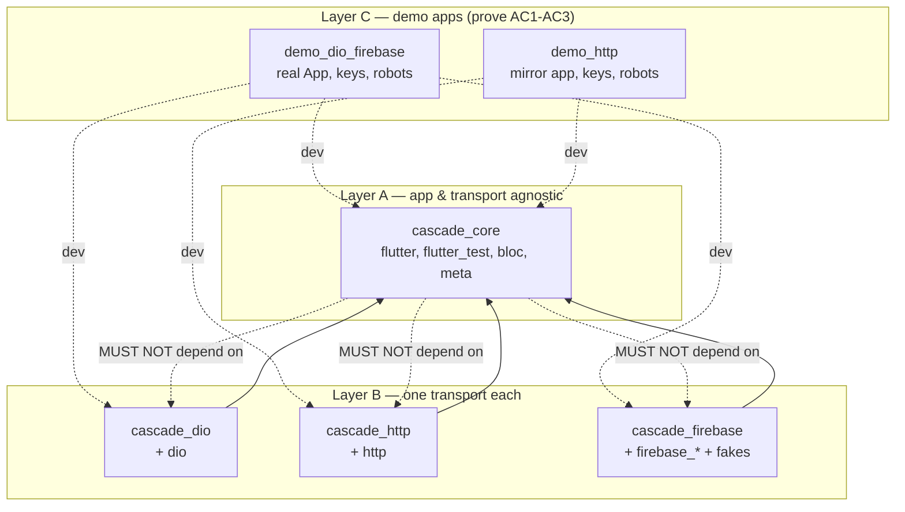

## Universal Flutter Acceptance-Test Harness — Extensive Plan

> **Source of truth:** `/Users/robertasskiauteris/flutterprojects/teroxx/front_end/docs/test_harness_requirements.md`
> (R1.1–R7.3, AC1–AC6, D1–D5).
> **Brainstorm:** `docs/brainstorm/2026-07-10-universal-flutter-acceptance-test-harness-brainstorm-doc.md`.
> **Run ledger:** `docs/.wingspan-run.md` (local-branch-only `feat/test-harness`, full spec, unattended).
> **This plan was produced non-interactively.** Every point where the interactive `/plan`
> skill would have prompted is resolved toward the simplest spec-compliant option and
> recorded under **Auto-resolved Assumptions**.

All file paths in this plan are **relative to the workspace root**
`/Users/robertasskiauteris/flutterprojects/cascade_test/`. The build stage runs in a git
worktree and may only create/modify the paths enumerated in the **File Manifest (Scope
Contract)** below, plus their sibling test files. Any path not listed here is out of scope.

---

## Overview

Build a reusable, app-agnostic **system-test harness** for Flutter apps as a **pub-workspace
monorepo** inside `cascade_test`. A test pumps the *real* `App` widget with all real wiring
(interceptors, serialization, error mapping, blocs) and fakes only the outermost I/O boundary
(HTTP transport, Firebase SDKs). Configuration is a synchronous Dart-cascade builder; the UI
is driven by `Key`s through BDD robots.

The deliverable is six packages under `packages/`:

- **Layer A — `cascade_core`** (Flutter package; app/transport-agnostic): stub registry,
  cascade builder, `WidgetTesterX`, `Robot` base, `HarnessConfig`, observability.
- **Layer B — `cascade_dio` / `cascade_http` / `cascade_firebase`** (one transport dependency
  each): thin translators that install a fake transport wired to the **one shared registry**.
- **Layer C — `demo_dio_firebase` / `demo_http`** (small *real* apps): executable proof of
  AC1–AC3.

The package dependency graph is the enforcement mechanism for **AC5**: `cascade_core`'s
pubspec lists no dio/http/firebase, so a stray `import 'package:dio/...'` in Layer A fails
analysis before any test runs. Terminal state: **local feature branch only** — no publish,
no PR, no CI, no remote.

---

## Problem Statement

Teroxx `front_end` has a fluent widget-test harness (`test/support/test_app.dart`, 1020 LOC)
that ~100 test files depend on. It works but has two structural defects the spec targets:

1. **App-coupled.** It imports `App`, `app_ui`, and feature keys directly
   (`test_app.dart:3-21`), so it cannot be reused by another app.
2. **Stubs the wrong layer.** It mocks the `ApiClient` *wrapper*
   (`MockApiClient extends Mock implements ApiClient`, `test_app.dart:606`) and **reconstructs
   app errors inside stubs** — `throw ApiClientException.fromDioError(...)`
   (`test_app.dart:499`) and a magic `250` "noContent" sentinel (`test_app.dart:512`). Real
   interceptors, token handling, serialization, and error mapping are therefore never
   exercised, and production error-mapping logic is re-simulated in the test double. This is
   exactly what **D4/R2.2** forbid.

It also violates **R3.2**: `_TestAppWidget.build()` runs binding init, `Bloc.observer`
assignment, storage fakes, and Firebase init *inside a widget build method*
(`test_app.dart:428-446`).

**Goal:** a reusable harness where tests are full-system (UI → real app wiring → real
interceptors/serialization → **faked transport** → back to UI), the stub layer is the
transport boundary (`HttpClientAdapter` / `MockClient` / faked Firebase SDKs), and the only
per-app code is a thin Layer C (`≤ a few hundred lines`, R1.1).

---

## Proposed Solution

### The two-abstraction model (resolves R2.1 vs R6.1 tension)

The spec wants "one declarative model for all backends" (R2.1) but the backends fake at
different levels. Resolution — **two cooperating abstractions behind one cascade surface**:

1. **`StubRegistry`** (request/response) — keyed by an abstract `BoundaryRequest`, carrying
   *all* of R2.3–R2.7 (matching, sequencing, latency, recording, fail-fast). **HTTP routes**
   and **Firebase callables** both flow through it. Justified by the spec itself: R6.2 applies
   R2.3–R2.7 to callables, while R6.1 describes only declarative *seeding* for stores.
2. **`Seeder`** (stateful stores, owned by `cascade_firebase`) — Firestore/Auth/Storage seeds
   are *initial state*, not stubbed calls; they do **not** pass through fail-fast or call
   recording (reading an unseeded collection legitimately returns empty).

`cascade_core` defines only the registry + a `TransportInstaller` seam; adapters implement the
translation. This seam is what makes **AC3** (swap adapter, zero test/robot change) hold.

### Fake at the transport boundary; never reconstruct app exceptions (D4)

- **dio** (`cascade_dio`): a hand-rolled `FakeHttpClientAdapter implements HttpClientAdapter`
  whose `fetch()` resolves the registry and returns a real `dio.ResponseBody`. A stubbed
  **403 is a `ResponseBody(statusCode: 403)`** — dio's own `validateStatus` then raises a real
  `DioException`, and the app's production `ApiClientException.fromDioError` runs as the system
  under test. The harness never constructs app exceptions.
- **http** (`cascade_http`): a `MockClient(handler)` whose handler returns a real
  `http.Response(body, statusCode)`; the app's real error mapping decides.
- **Firebase callables** (`cascade_firebase`): a thin **facade** (`CallableClient`) returns raw
  decoded data or throws a real `FirebaseFunctionsException(code)` — the Firebase analog of D4,
  so the app's real callable-error mapping (which sits *above* the facade) runs.

### Why a hand-rolled dio adapter instead of `charlatan`

**Decision: hand-roll `FakeHttpClientAdapter`; do not depend on `charlatan`.** Evidence:

- `charlatan` is **not** in the local pub cache (verified); latest is `0.5.0`, dio-5.9
  compatibility unverified. It is an external, fragile dependency for the most AC5-sensitive
  layer.
- The dio target interface is stable and confirmed in cache
  (`dio-5.9.2/lib/src/adapter.dart:55`): `Future<ResponseBody> fetch(RequestOptions options,
  Stream<Uint8List>? requestStream, Future<void>? cancelFuture)`, with
  `ResponseBody.fromString(String, int statusCode, {headers})`
  (`dio-5.9.2/lib/src/adapter.dart:88`). Implementing `fetch()` against the registry is ~40
  lines.
- Removing the dep means **fewer moving parts and one less transitive dependency in Layer B**,
  which directly strengthens AC5 and removes a version-compatibility risk (YAGNI win). This
  supersedes brainstorm assumption **A4** ("use charlatan if compatible") — the compatibility
  question is moot because we are not adding it.

### Callable fake: thin facade, not a `FirebaseFunctions` subclass

**Decision: inject a thin app-owned `CallableClient` facade, not the raw `FirebaseFunctions`.**
Evidence (cloud_functions-6.3.3 in cache):

- `FirebaseFunctions._({required app, region})` is a **private constructor**
  (`cloud_functions-6.3.3/lib/src/firebase_functions.dart:12`) — not subclassable from outside
  the package.
- `HttpsCallableResult._(this._data)` is a **private constructor**
  (`.../lib/src/https_callable_result.dart`) — a fake cannot construct a real result.
- `FirebaseFunctionsException({...})` has a **public constructor**
  (`cloud_functions_platform_interface-6.0.3/lib/src/firebase_functions_exception.dart:15`) —
  a fake **can** throw a real one.

R6.2 explicitly permits "faking the injected `FirebaseFunctions`/**facade**". So `cascade_firebase`
defines a *thin transport-level* facade `CallableClient` (`Future<T> call<T>(String name,
{Object? data})`) that the demo injects. Production `FirebaseCallableClient` wraps
`functions.httpsCallable(name).call(data)`; the harness `FakeCallableClient` consults the
registry, returning stubbed data or **throwing a real `FirebaseFunctionsException`**. The
facade returns raw data / raw exception (no app-level mapping), so the app's real callable
error mapping — which lives *above* the facade, exactly as `ApiClientException.fromDioError`
lives above `HttpClientAdapter` — is the system under test (D4 preserved). Recorded as
assumption **A11**.

---

## Technical Approach

### Architecture — the AC5-enforcing dependency graph



- Harness packages (`cascade_*`) are **`dev_dependencies`** of the demos (a harness is a test
  dependency — mirrors real adoption per R1.2). Demos' *production* deps are the real transports
  (dio/http/firebase/bloc).
- `cascade_core` depends on `bloc` (for the `BlocObserver` hook, R7.2) but **not** on
  `flutter_bloc`, and on **no** HTTP/Firebase package. `bloc` is state-management, not a
  transport, so R1.1's "no specific HTTP/Firebase package" is satisfied.

### Core data model (concrete contracts the build worker must implement verbatim)

```dart
// packages/cascade_core/lib/src/registry/boundary_request.dart
enum BoundaryKind { http, callable }

final class BoundaryRequest {
  const BoundaryRequest({
    required this.kind,
    required this.method,      // 'GET','POST',... ; callables use 'CALL'
    required this.endpoint,    // URL path (http) or callable name (functions)
    this.body,
    this.query = const <String, dynamic>{},
    this.headers = const <String, String>{},
  });
  final BoundaryKind kind;
  final String method;
  final String endpoint;
  final Object? body;
  final Map<String, dynamic> query;
  final Map<String, String> headers;
}
```

```dart
// packages/cascade_core/lib/src/registry/boundary_response.dart
final class BoundaryResponse {          // a transport-shaped response (incl. non-2xx)
  const BoundaryResponse({required this.statusCode, this.body, this.headers = const {}});
  final int statusCode;
  final Object? body;
  final Map<String, String> headers;
}

enum BoundaryErrorKind { timeout, connection, cancel, badResponse, callable, unknown }

final class BoundaryError {             // a genuine transport failure (NOT a status code)
  const BoundaryError({required this.kind, this.code, this.message, this.statusCode, this.body});
  final BoundaryErrorKind kind;
  final String? code;      // e.g. callable 'permission-denied'
  final String? message;
  final int? statusCode;
  final Object? body;
}
```

**Key rule (D4):** a non-2xx **status code** (403/500) is a *success-shaped outcome* — a
`BoundaryResponse(statusCode: 403, ...)`. The adapter returns it as a real transport response
and lets the app decide it is an error. `BoundaryError` is reserved for *genuine transport
failures* (timeouts, socket errors) and *callable error codes*. This keeps all transport types
out of core while letting adapters raise faithful native errors.

```dart
// packages/cascade_core/lib/src/registry/stub.dart
sealed class StubOutcome { const StubOutcome({this.latency}); final Duration? latency; }
final class RespondWith extends StubOutcome {              // includes non-2xx statuses
  const RespondWith(this.response, {super.latency}); final BoundaryResponse response;
}
final class FailWith extends StubOutcome {                 // transport failure / callable error
  const FailWith(this.error, {super.latency}); final BoundaryError error;
}

final class Stub {                       // one matcher, an ordered list of outcomes (R2.6)
  Stub({required this.matcher, required this.outcomes});
  final StubMatcher matcher;
  final List<StubOutcome> outcomes;      // 1 element = single; N = sequence
  int _cursor = 0;                       // advances per call; clamps at last
}
```

```dart
// packages/cascade_core/lib/src/registry/stub_registry.dart
final class StubRegistry {
  final List<Stub> _stubs = [];
  final CallRecorder recorder = CallRecorder();
  Duration defaultLatency = const Duration(milliseconds: 100);   // R2.5

  void register(Stub stub);              // later registration for same key OVERRIDES (R2.4)
  ResolvedOutcome resolve(BoundaryRequest request);  // records call; throws MissingStubError (R2.3)
}
```

### Adapter contracts (each Layer B package)

- **`cascade_dio`** — `FakeHttpClientAdapter implements dio.HttpClientAdapter`:
  ```dart
  Future<ResponseBody> fetch(options, requestStream, cancelFuture) async {
    final req = mapRequestOptions(options);         // -> BoundaryRequest(kind: http)
    final out = registry.resolve(req);              // may throw MissingStubError
    await Future<void>.delayed(out.latency);        // R2.5
    return switch (out.outcome) {
      RespondWith(:final response) => ResponseBody.fromString(
          jsonEncode(response.body), response.statusCode,
          headers: {Headers.contentTypeHeader: const ['application/json']}),
      FailWith(:final error) => throw _toDioException(error, options), // timeout/etc.
    };
  }
  ```
  A stubbed 403 is `RespondWith(BoundaryResponse(403))`; dio's `validateStatus` throws its own
  `DioException(badResponse)` so the app's real mapping runs (D4). Installed via
  `builder.useDio(Dio dio)` → sets `dio.httpClientAdapter = FakeHttpClientAdapter(registry)`;
  the same real `Dio` (with the app's real interceptors) is injected into `App`.
- **`cascade_http`** — `MockClient(handler)` where the handler maps `http.Request` →
  `BoundaryRequest` → `registry.resolve` → `http.Response(jsonEncode(body), statusCode,
  headers: {'content-type':'application/json'})`; `FailWith` → `throw http.ClientException(...)`.
  Installed via `builder.useHttpClient()` → exposes `harness.httpClient` for injection.
- **`cascade_firebase`** — `builder.useFirebase()` installs and exposes:
  `FakeFirebaseFirestore` (fake_cloud_firestore), `MockFirebaseAuth` (firebase_auth_mocks),
  `MockFirebaseStorage` (firebase_storage_mocks), and `FakeCallableClient(registry)`. Adds
  cascade verbs via `extension on TestHarnessBuilder`: `withCallable`, `withCollection`,
  `withDocument`, `withSignedInUser`, `withSignedOutUser`. Seeds run at `buildHarness()` time,
  never in a widget build (R3.2).

### One cascade surface (R3.1) and R3.2 compliance

`TestHarnessBuilder` (core) exposes the HTTP + recording verbs; adapters add their verbs by
extension, so the demo's Layer C `TestApp` presents the spec's exact surface:

```dart
final app = TestApp()
  ..withGet('/policies', data: policiesFixture)
  ..withPostSequence('/orders', [Res(403), Res(200, data: orderFixture)]) // R2.6
  ..withCallable('createOrder', error: FunctionsError.permissionDenied)   // firebase ext
  ..withSignedInUser(uid: 'u1')                                           // firebase ext
  ..withCollection('users', [{'id': 'u1', 'name': 'Ada'}]);              // firebase ext
await tester.pumpWidget(app.build());
```

All builder mutators return `void` (so `..` cascades are the idiom, R3.1) and are
side-effect-free until `build()`. Binding init, `Bloc.observer` assignment, storage fakes, and
seeds all run inside `TestApp.buildHarness()` (a plain Dart method, **not** a widget `build`),
fixing the prior art's R3.2 violation. `build()` returns a pure, side-effect-free widget.

### `WidgetTesterX` verbs (R4.3) — full ported list

Ported from `teroxx/front_end/test/support/test_app.dart:641-937`, de-coupled from app types:
`pumpThroughAnimations([duration])`, `expectWidget`, `expectNoWidget`, `expectText` (Text +
RichText descendants), `tapButton`, `enterTextByKey`, `enterPinByKey`, `submitText`,
`expectInputHasText`, `expectPinInputHasText`, `expectInputHasFocus`, `expectButtonEnabled`,
`expectButtonDisabled`, `printOutStringKeys`. **Added:** `pumpUntil(Finder, {timeout, step})` —
generalizes the prior art's manual 20/40-iteration `pump()` loops
(`auth_robot.dart:56-62,89-91`) into one sanctioned polling primitive; **never** `pumpAndSettle`
(real apps have repeating timers). The hardcoded `AppButton`/`AppChoiceButton` checks
(`test_app.dart:922-936`) and the odometer special case (`test_app.dart:738-773`) are replaced
by pluggable `HarnessConfig` resolvers/extractors (R4.4).

### `HarnessConfig` (R4.4)

```dart
// packages/cascade_core/lib/src/builder/harness_config.dart
typedef ButtonResolver = bool? Function(Widget widget);   // enabled? or null if not-a-button
typedef TextExtractor  = String? Function(Widget widget); // custom text, or null

final class HarnessConfig {
  const HarnessConfig({this.buttonResolvers = const [], this.textExtractors = const [],
                       this.defaultLatency = const Duration(milliseconds: 100)});
  final List<ButtonResolver> buttonResolvers;
  final List<TextExtractor> textExtractors;
  final Duration defaultLatency;
}
void configureHarness(HarnessConfig config);  // set in setUp; read by WidgetTesterX verbs
void resetHarnessConfig();                     // call in tearDown
```

`expectButtonEnabled/Disabled` consult `buttonResolvers` before the built-in `OutlinedButton`
fallback and finally `fail(...)`. `expectText` consults `textExtractors` before the built-in
`Text`/`RichText` walk.

### Observability (R7)

`builder.withObserver(BlocObserver)` sets `Bloc.observer` **only if provided** (no hijack — key
for AC4 compat). `LoggingObserver` (a verbose `BlocObserver`, ported from `test_app.dart:613`)
ships in core. `builder.withBoundaryLog()` toggles per-call printing (method, endpoint, status,
latency) from the recorder (R7.1). `printOutStringKeys` stays on `WidgetTesterX` (R7.3). A
Riverpod `ProviderObserver` equivalent is *designed-for* (parallel `withProviderObserver` could
be added in a future adapter with no Layer A change) but **not built** (YAGNI, R7.2 wording).

---

## File Manifest (Scope Contract)

Every path the build stage may create/modify/delete. Grouped by phase. `C`=create,
`M`=modify, `D`=delete. Standard VGV package scaffolding for each package
(`analysis_options.yaml` = `include: package:very_good_analysis/analysis_options.yaml`,
`.gitignore`, `README.md`, `CHANGELOG.md`, `LICENSE`) is implied per package and included in
the count. Test files follow VGV **one-test-file-per-unit**.

### Root (workspace umbrella)

| Path | Op | Purpose |
|---|---|---|
| `pubspec.yaml` | M | Add `workspace:` listing the 6 members; keep `name: cascade_test`, `environment: sdk: ^3.12.0`; keep repo-wide `dev_dependencies` (very_good_analysis, test). Becomes a pure umbrella. |
| `pubspec.lock` | M | Single shared workspace lockfile (regenerated by `dart pub get`). |
| `lib/cascade_test.dart` | D | Remove placeholder public API (root is now an umbrella). |
| `lib/src/cascade_test.dart` | D | Remove placeholder implementation. |
| `test/src/cascade_test_test.dart` | D | Remove placeholder test. |
| `README.md` | M | Repurpose as the monorepo/harness README (AC6 — see Documentation Plan). |
| `docs/MIGRATION.md` | C | Migration note for apps with an existing harness (AC6, R1.4, AC4 compat). |
| `analysis_options.yaml` | — | Unchanged (already includes very_good_analysis). |

### `packages/cascade_core` (Layer A)

| Path | Op | Purpose / Requirement |
|---|---|---|
| `packages/cascade_core/pubspec.yaml` | C | `resolution: workspace`; deps: `flutter` (sdk), `bloc`, `meta`; dev: `flutter_test` (sdk), `very_good_analysis`. **No dio/http/firebase.** |
| `packages/cascade_core/lib/cascade_core.dart` | C | Public barrel. |
| `packages/cascade_core/lib/src/registry/boundary_request.dart` | C | `BoundaryRequest`, `BoundaryKind` (R2.1). |
| `packages/cascade_core/lib/src/registry/boundary_response.dart` | C | `BoundaryResponse`, `BoundaryError`, `BoundaryErrorKind` (R2.5). |
| `packages/cascade_core/lib/src/registry/matchers.dart` | C | `StubMatcher`, exact (default) + `prefix`/`pattern` + query/body matchers (R2.4). |
| `packages/cascade_core/lib/src/registry/stub.dart` | C | `Stub`, `StubOutcome` (`RespondWith`/`FailWith`), sequence cursor (R2.6). |
| `packages/cascade_core/lib/src/registry/stub_registry.dart` | C | `StubRegistry`: register/override, `resolve`, latency (R2.3-R2.6). |
| `packages/cascade_core/lib/src/registry/call_recorder.dart` | C | `CallRecorder`, `RecordedCall`, `expectCalled`/`expectNeverCalled`/`expectCalledWith` (R2.7). |
| `packages/cascade_core/lib/src/registry/missing_stub_error.dart` | C | `MissingStubError` with method + full endpoint + payload in message (R2.3/AC2). |
| `packages/cascade_core/lib/src/builder/test_harness_builder.dart` | C | Cascade builder; HTTP verbs + `expectCalled*`; `buildHarness()`; observer/log wiring (R3.1-R3.2, R7). |
| `packages/cascade_core/lib/src/builder/transport_installer.dart` | C | `TransportInstaller` seam + `Harness` (exposes installed fakes) + `HarnessBinding` (AC3). |
| `packages/cascade_core/lib/src/builder/harness_config.dart` | C | `HarnessConfig`, `ButtonResolver`, `TextExtractor`, `configureHarness`/`resetHarnessConfig` (R4.4). |
| `packages/cascade_core/lib/src/tester/widget_tester_x.dart` | C | Full R4.3 verb list + `pumpUntil`; consults `HarnessConfig`. |
| `packages/cascade_core/lib/src/tester/finder_extensions.dart` | C | Internal `verifyText` helper (ported from Teroxx `helpers/finder_extension.dart`). |
| `packages/cascade_core/lib/src/robot/robot.dart` | C | `Robot` base holding `WidgetTester` + R4.3 verbs (R5.1, R5.3 `...IfPresent` guidance). |
| `packages/cascade_core/lib/src/observability/logging_observer.dart` | C | `LoggingObserver extends BlocObserver` (R7.2). |
| `packages/cascade_core/lib/src/observability/boundary_log.dart` | C | Boundary-call log formatting + toggle (R7.1). |
| `packages/cascade_core/test/registry/boundary_request_test.dart` | C | Unit. |
| `packages/cascade_core/test/registry/matchers_test.dart` | C | Exact/prefix/pattern/query/body (R2.4). |
| `packages/cascade_core/test/registry/stub_registry_test.dart` | C | Override, sequencing, latency, resolve, fail-fast (R2.3-R2.6). |
| `packages/cascade_core/test/registry/call_recorder_test.dart` | C | `expectCalled*` (R2.7). |
| `packages/cascade_core/test/registry/missing_stub_error_test.dart` | C | Message contains method + endpoint + payload (AC2). |
| `packages/cascade_core/test/builder/test_harness_builder_test.dart` | C | Cascade purity, verb→registry wiring, `buildHarness` side-effect placement (R3.1-R3.2). |
| `packages/cascade_core/test/builder/harness_config_test.dart` | C | Resolver/extractor precedence (R4.4). |
| `packages/cascade_core/test/tester/widget_tester_x_test.dart` | C | Port of Teroxx `widget_tester_x_test.dart` against `MinimalApp` (R4.3). |
| `packages/cascade_core/test/robot/robot_test.dart` | C | Robot base verbs (R5.1). |
| `packages/cascade_core/test/observability/logging_observer_test.dart` | C | Observer opt-in behavior (R7.2). |
| `packages/cascade_core/test/helpers/minimal_app.dart` | C | Test-only `MinimalApp` (ported from Teroxx `minimal_app.dart`, de-app-coupled). |
| `packages/cascade_core/test/no_forbidden_imports_test.dart` | C | **AC5 guard:** asserts `lib/` contains no `package:dio`/`package:http`/`package:*firebase*`/`package:cloud_*` import. |

### `packages/cascade_dio` (Layer B)

| Path | Op | Purpose |
|---|---|---|
| `packages/cascade_dio/pubspec.yaml` | C | `resolution: workspace`; deps: `cascade_core`, `dio: ^5.9.0`; dev: `flutter_test`, `very_good_analysis`. No http/firebase. |
| `packages/cascade_dio/lib/cascade_dio.dart` | C | Barrel. |
| `packages/cascade_dio/lib/src/fake_http_client_adapter.dart` | C | `FakeHttpClientAdapter implements HttpClientAdapter` (R2.2/D4). |
| `packages/cascade_dio/lib/src/boundary_request_mapper.dart` | C | `RequestOptions` → `BoundaryRequest`. |
| `packages/cascade_dio/lib/src/dio_installer.dart` | C | `extension on TestHarnessBuilder { void useDio(Dio) }` + `Harness.dio`. |
| `packages/cascade_dio/test/fake_http_client_adapter_test.dart` | C | Real `Dio`+interceptors: GET, POST 403→200 (R2.6), transport error, latency, missing-stub. |
| `packages/cascade_dio/test/boundary_request_mapper_test.dart` | C | Path/query/body/header mapping. |
| `packages/cascade_dio/test/dio_installer_test.dart` | C | Adapter swap + injection. |
| `packages/cascade_dio/test/no_forbidden_imports_test.dart` | C | **AC5 guard:** no `package:http`/firebase in `lib/`. |

### `packages/cascade_http` (Layer B)

| Path | Op | Purpose |
|---|---|---|
| `packages/cascade_http/pubspec.yaml` | C | deps: `cascade_core`, `http: ^1.6.0`; dev: `flutter_test`, `very_good_analysis`. No dio/firebase. |
| `packages/cascade_http/lib/cascade_http.dart` | C | Barrel. |
| `packages/cascade_http/lib/src/registry_mock_client.dart` | C | Builds `MockClient(handler)`; `Request`↔`BoundaryRequest`↔`Response` (R2.2). |
| `packages/cascade_http/lib/src/http_installer.dart` | C | `extension on TestHarnessBuilder { void useHttpClient() }` + `Harness.httpClient`. |
| `packages/cascade_http/test/registry_mock_client_test.dart` | C | GET, POST 403→200, error, latency, missing-stub. |
| `packages/cascade_http/test/http_installer_test.dart` | C | Client creation + injection. |
| `packages/cascade_http/test/no_forbidden_imports_test.dart` | C | **AC5 guard:** no dio/firebase in `lib/`. |

### `packages/cascade_firebase` (Layer B)

| Path | Op | Purpose |
|---|---|---|
| `packages/cascade_firebase/pubspec.yaml` | C | deps: `cascade_core`, `firebase_core: ^4.11.0`, `cloud_firestore: ^6.6.0`, `firebase_auth: ^6.5.4`, `cloud_functions: ^6.3.3`, `fake_cloud_firestore: ^4.1.1`, `firebase_auth_mocks: ^0.15.0`, `firebase_storage_mocks: ^0.8.0`, `firebase_storage: ^13.4.0`; dev: `flutter_test`, `very_good_analysis`. No dio/http. |
| `packages/cascade_firebase/lib/cascade_firebase.dart` | C | Barrel. |
| `packages/cascade_firebase/lib/src/callable_client.dart` | C | `CallableClient` facade + `FirebaseCallableClient` (prod) + `FakeCallableClient` (throws real `FirebaseFunctionsException`) (R6.2). |
| `packages/cascade_firebase/lib/src/functions_error.dart` | C | `FunctionsError` enum → callable error codes. |
| `packages/cascade_firebase/lib/src/firestore_seeder.dart` | C | Seeds `FakeFirebaseFirestore` (R6.1). |
| `packages/cascade_firebase/lib/src/auth_seeder.dart` | C | Seeds `MockFirebaseAuth` (R6.1). |
| `packages/cascade_firebase/lib/src/storage_seeder.dart` | C | Seeds `MockFirebaseStorage` (R6.1). |
| `packages/cascade_firebase/lib/src/firebase_installer.dart` | C | `extension on TestHarnessBuilder`: `withCallable`/`withCollection`/`withDocument`/`withSignedInUser`/`withSignedOutUser`; `Harness.firestore/auth/storage/callableClient` (R6.1-R6.4). |
| `packages/cascade_firebase/test/fake_callable_client_test.dart` | C | Data + error injection → real `FirebaseFunctionsException`; sequencing/fail-fast/recording (R6.2). |
| `packages/cascade_firebase/test/firestore_seeder_test.dart` | C | Collection/doc seeding + unseeded read = empty (R6.1). |
| `packages/cascade_firebase/test/auth_seeder_test.dart` | C | Signed-in/out + claims (R6.1). |
| `packages/cascade_firebase/test/storage_seeder_test.dart` | C | Storage seed (R6.1). |
| `packages/cascade_firebase/test/firebase_installer_test.dart` | C | Verbs wire to one shared registry (R6.4). |
| `packages/cascade_firebase/test/no_forbidden_imports_test.dart` | C | **AC5 guard:** no dio/http in `lib/`. |

### `packages/demo_dio_firebase` (Layer C — proves AC1, AC2)

| Path | Op | Purpose |
|---|---|---|
| `packages/demo_dio_firebase/pubspec.yaml` | C | prod deps: `flutter`, `flutter_bloc`, `bloc`, `dio`, `firebase_core`, `cloud_firestore`, `firebase_auth`, `cloud_functions`; dev: `flutter_test`, `cascade_core`, `cascade_dio`, `cascade_firebase`, `very_good_analysis`. |
| `packages/demo_dio_firebase/lib/app/app.dart` | C | Real `App` widget; injectable `Dio`, `FirebaseFirestore`, `FirebaseAuth`, `CallableClient` (R1.3). |
| `packages/demo_dio_firebase/lib/app/dio_factory.dart` | C | Shared `Dio` factory: real auth-header interceptor + 403→refresh→retry + error mapping (SUT, D4). |
| `packages/demo_dio_firebase/lib/api/api_client.dart` | C | Small real API client (serialization + `ApiException` mapping — the SUT). |
| `packages/demo_dio_firebase/lib/features/login/login_page.dart` | C | Key-driven login. |
| `packages/demo_dio_firebase/lib/features/login/login_keys.dart` | C | `*_keys.dart` in production code (R4.2). |
| `packages/demo_dio_firebase/lib/features/login/login_cubit.dart` | C | Real bloc/cubit driving auth. |
| `packages/demo_dio_firebase/lib/features/policies/policies_page.dart` | C | GET screen (AC1). |
| `packages/demo_dio_firebase/lib/features/policies/policies_keys.dart` | C | Keys (R4.2). |
| `packages/demo_dio_firebase/lib/features/policies/policies_cubit.dart` | C | Real cubit. |
| `packages/demo_dio_firebase/lib/features/orders/orders_page.dart` | C | POST 403→200 screen (AC1, R2.6). |
| `packages/demo_dio_firebase/lib/features/orders/orders_keys.dart` | C | Keys (R4.2). |
| `packages/demo_dio_firebase/lib/features/orders/orders_cubit.dart` | C | Real cubit; submits order body (for `expectCalledWith`). |
| `packages/demo_dio_firebase/lib/features/profile/profile_page.dart` | C | Firestore-seeded render + callable `createOrder` error (AC1). |
| `packages/demo_dio_firebase/lib/features/profile/profile_keys.dart` | C | Keys (R4.2). |
| `packages/demo_dio_firebase/lib/features/profile/profile_cubit.dart` | C | Real cubit; callable error mapping ABOVE the facade (D4). |
| `packages/demo_dio_firebase/lib/main.dart` | C | Trivial prod entrypoint (wires real Firebase/Dio) — keeps demo a real runnable app. |
| `packages/demo_dio_firebase/test/support/test_app.dart` | C | **Layer C** `TestApp extends TestHarnessBuilder`; `useDio`+`useFirebase`; default fixtures; `HarnessConfig`; `build()→Widget`. |
| `packages/demo_dio_firebase/test/support/fixtures.dart` | C | Fixture payloads (policies, order, user). |
| `packages/demo_dio_firebase/test/robots/login_robot.dart` | C | **Shared-flow robot** (byte-identical to demo_http). |
| `packages/demo_dio_firebase/test/robots/orders_robot.dart` | C | **Shared-flow robot** (byte-identical to demo_http). |
| `packages/demo_dio_firebase/test/robots/profile_robot.dart` | C | Firebase-only robot (AC1; not part of shared flow). |
| `packages/demo_dio_firebase/test/robots/robots.dart` | C | Barrel (shared subset identical to demo_http). |
| `packages/demo_dio_firebase/test/acceptance/ac1_full_flow_test.dart` | C | **AC1** end-to-end. |
| `packages/demo_dio_firebase/test/acceptance/ac2_unstubbed_call_test.dart` | C | **AC2** fail-fast. |

### `packages/demo_http` (Layer C — proves AC3)

| Path | Op | Purpose |
|---|---|---|
| `packages/demo_http/pubspec.yaml` | C | prod deps: `flutter`, `flutter_bloc`, `bloc`, `http`; dev: `flutter_test`, `cascade_core`, `cascade_http`, `very_good_analysis`. No firebase. |
| `packages/demo_http/lib/app/app.dart` | C | **Mirror** `App`; injectable `http.Client`. |
| `packages/demo_http/lib/app/http_client_factory.dart` | C | Shared client + real error mapping (SUT). |
| `packages/demo_http/lib/api/api_client.dart` | C | http-based API client (serialization + error mapping). |
| `packages/demo_http/lib/features/login/login_page.dart` | C | Mirror screen, **identical keys**. |
| `packages/demo_http/lib/features/login/login_keys.dart` | C | Identical `ValueKey` string values to dio demo (R4.2). |
| `packages/demo_http/lib/features/login/login_cubit.dart` | C | Mirror cubit. |
| `packages/demo_http/lib/features/policies/policies_page.dart` | C | Mirror GET screen. |
| `packages/demo_http/lib/features/policies/policies_keys.dart` | C | Identical keys. |
| `packages/demo_http/lib/features/policies/policies_cubit.dart` | C | Mirror cubit. |
| `packages/demo_http/lib/features/orders/orders_page.dart` | C | Mirror POST 403→200 screen. |
| `packages/demo_http/lib/features/orders/orders_keys.dart` | C | Identical keys. |
| `packages/demo_http/lib/features/orders/orders_cubit.dart` | C | Mirror cubit. |
| `packages/demo_http/lib/main.dart` | C | Trivial prod entrypoint. |
| `packages/demo_http/test/support/test_app.dart` | C | **Layer C** `TestApp`; `useHttpClient` only; same fixtures/config shape. |
| `packages/demo_http/test/support/fixtures.dart` | C | Same fixture payloads. |
| `packages/demo_http/test/robots/login_robot.dart` | C | **Byte-identical** to demo_dio_firebase copy. |
| `packages/demo_http/test/robots/orders_robot.dart` | C | **Byte-identical** to demo_dio_firebase copy. |
| `packages/demo_http/test/robots/robots.dart` | C | Barrel (identical shared subset). |
| `packages/demo_http/test/acceptance/ac3_mirror_flow_test.dart` | C | **AC3** same-shaped flow. |
| `packages/demo_http/test/robots_parity_test.dart` | C | **AC3 machine proof:** reads both demos' `login_robot.dart`/`orders_robot.dart` and asserts byte-equality. |

---

## Implementation Phases

Each phase is independently testable. **Gate for every phase:** `flutter analyze`
(or `dart analyze`) is clean for the touched package(s) **and** its tests pass via the
very_good_cli MCP `test` tool. Do not advance on a red gate.

### Phase 0: Workspace skeleton — Foundation *(effort: S)*

- **Tasks:** Modify root `pubspec.yaml` to add `workspace: [packages/cascade_core,
  packages/cascade_dio, packages/cascade_http, packages/cascade_firebase,
  packages/demo_dio_firebase, packages/demo_http]`. Create all six package directories with
  `pubspec.yaml` (each `resolution: workspace`), `analysis_options.yaml`, and a stub barrel.
  Delete root `lib/cascade_test.dart`, `lib/src/cascade_test.dart`,
  `test/src/cascade_test_test.dart`.
- **Deliverables:** Workspace resolves with a single `dart pub get`; `firebase_auth_mocks`,
  `firebase_storage_mocks` fetched from pub.dev.
- **Success criteria:** `dart pub get` succeeds at root; `flutter analyze` clean across empty
  packages; no orphaned placeholder files.

### Phase 1: `cascade_core` registry (R2) — Core Implementation *(effort: M)*

- **Tasks:** Implement `boundary_request.dart`, `boundary_response.dart`, `matchers.dart`,
  `stub.dart`, `stub_registry.dart`, `call_recorder.dart`, `missing_stub_error.dart`.
- **Tests to write:** `matchers_test`, `stub_registry_test` (override R2.4, sequence R2.6,
  latency R2.5, resolve, fail-fast R2.3), `call_recorder_test` (R2.7),
  `missing_stub_error_test` (message format, AC2), `boundary_request_test`.
- **Success criteria:** All registry unit tests green; `MissingStubError.message` demonstrably
  contains `<METHOD> <endpoint>` + JSON payload; 100% line coverage on registry files.

### Phase 2: `cascade_core` builder/tester/robot/observability (R3,R4,R5,R7) *(effort: M)*

- **Tasks:** `test_harness_builder.dart`, `transport_installer.dart`, `harness_config.dart`,
  `widget_tester_x.dart` (+ `finder_extensions.dart`), `robot.dart`,
  `logging_observer.dart`, `boundary_log.dart`. Add `test/helpers/minimal_app.dart` and the
  AC5 guard test.
- **Tests to write:** `test_harness_builder_test` (cascade purity + R3.2 side-effect
  placement), `harness_config_test` (R4.4 precedence), `widget_tester_x_test` (port of Teroxx
  suite against `MinimalApp`), `robot_test`, `logging_observer_test`,
  `no_forbidden_imports_test`.
- **Success criteria:** Green; `cascade_core` has zero forbidden imports (guard test passes);
  `flutter analyze` clean.

### Phase 3: `cascade_dio` (R2.2, D4) *(effort: M)*

- **Tasks:** `fake_http_client_adapter.dart`, `boundary_request_mapper.dart`,
  `dio_installer.dart`.
- **Tests to write:** `fake_http_client_adapter_test` (real `Dio` with an interceptor: GET
  200; POST returns 403 then 200 across two calls, R2.6; injected timeout → `DioException`;
  100ms latency observed; unstubbed → `MissingStubError`), `boundary_request_mapper_test`,
  `dio_installer_test`, `no_forbidden_imports_test`.
- **Success criteria:** A stubbed 403 surfaces as a real `DioException` the app maps (no app
  exception constructed by the harness); guard test passes.

### Phase 4: `cascade_http` (R2.2) *(effort: S)*

- **Tasks:** `registry_mock_client.dart`, `http_installer.dart`.
- **Tests to write:** `registry_mock_client_test` (GET, POST 403→200, error, latency,
  missing-stub), `http_installer_test`, `no_forbidden_imports_test`.
- **Success criteria:** Same registry semantics as dio via `MockClient`; guard test passes.

### Phase 5: `cascade_firebase` (R6) *(effort: M-L)*

- **Tasks:** `callable_client.dart`, `functions_error.dart`, `firestore_seeder.dart`,
  `auth_seeder.dart`, `storage_seeder.dart`, `firebase_installer.dart`.
- **Tests to write:** `fake_callable_client_test` (data return; error → real
  `FirebaseFunctionsException`; sequence/fail-fast/recording via the shared registry),
  `firestore_seeder_test` (seed + unseeded-read-empty), `auth_seeder_test`,
  `storage_seeder_test`, `firebase_installer_test`, `no_forbidden_imports_test`.
- **Success criteria:** Callables flow through the same `StubRegistry` as HTTP; seeds do not
  record/fail-fast; no Firebase type leaks to core (R6.4); guard test passes.

### Phase 6: `demo_dio_firebase` (AC1, AC2) *(effort: L)*

- **Tasks:** Build the real `App`, `dio_factory` (real interceptors + 403-refresh-retry),
  `api_client`, four features (login/policies/orders/profile) with `*_keys.dart`, cubits, and
  `main.dart`. Write Layer C `test/support/test_app.dart`, `fixtures.dart`, robots.
- **Tests to write:**
  - `ac1_full_flow_test.dart` — seeds Firestore (`withCollection`/`withSignedInUser`), stubs
    one GET (`/policies`), one POST returning **403 then 200** (`/orders`), one callable error
    (`createOrder`), logs in via `LoginRobot`, drives by keys only, asserts UI text
    (`expectText`) **and** `expectCalledWith('/orders', bodyMatcher)`.
  - `ac2_unstubbed_call_test.dart` — taps a button hitting an unstubbed endpoint; expects the
    test to fail with a `MissingStubError` whose message contains the method + full path.
- **Success criteria:** AC1 test green; AC2 test asserts the fail-fast message; robots contain
  no raw `find.byType`/`tester.tap` (R5.2).

### Phase 7: `demo_http` (AC3) *(effort: M)*

- **Tasks:** Mirror `App` + `http_client_factory` + `api_client` + login/policies/orders with
  **identical keys**. Copy `login_robot.dart`/`orders_robot.dart`/`robots.dart` **verbatim**
  from `demo_dio_firebase`. Write Layer C `test/support/test_app.dart` (http installer only).
- **Tests to write:** `ac3_mirror_flow_test.dart` (same-shaped GET + POST 403→200 +
  `expectCalledWith`), `robots_parity_test.dart` (byte-equality of the shared robot files
  across the two demos).
- **Success criteria:** AC3 test green using the **same** robot code and **zero** Layer A
  change; parity test green.

### Phase 8: Docs (AC6), AC5 aggregate verification, AC4 compatibility *(effort: M)*

- **Tasks:** Author the root `README.md` (adoption checklist R1.3, key convention R4.2,
  writing robots, migration note pointer) and `docs/MIGRATION.md` (incremental adoption R1.4 +
  AC4 compatibility argument). Confirm every Layer A/B `no_forbidden_imports_test` passes and
  record the AC5 evidence.
- **Success criteria:** README covers all four AC6 topics; full workspace
  `very_good test --recursive` + `flutter analyze` green; AC5 guard tests green in all four
  Layer A/B packages.

---

## Alternative Approaches Considered

- **Single package + import lints (rejected).** A lint is not "a package dependency graph"
  (fails AC5 as written); co-resident transport code means nothing physically prevents a core
  import. Weaker guarantee, easy to regress.
- **Melos-managed monorepo (fallback only).** Extra tool + bootstrap for zero benefit over
  SDK-native pub workspaces at this scale (YAGNI). Kept in reserve only if pub
  workspaces + Firebase plugins show friction at Dart 3.12 / Flutter 3.44.
- **Depend on `charlatan` for the dio fake (rejected).** Not cached, dio-5.9 compatibility
  unverified, adds a fragile transitive dep to the most AC5-sensitive layer. Hand-rolling
  `fetch()` against the confirmed stable interface is ~40 lines and removes the dependency.
- **Subclass `FirebaseFunctions` / return real `HttpsCallableResult` (rejected — infeasible).**
  Both have private constructors; the spec-sanctioned thin `CallableClient` facade is cleaner
  and preserves D4.
- **Shared `demo_shared` robots package for AC3 (rejected — YAGNI).** Byte-identical robot
  files + a parity test give an equally strong, machine-checkable "zero robot change" proof
  without a new package.

---

## Acceptance Criteria

### Measurable AC mapping (AC1–AC6)

| AC | Requirement | Proven by (file) | Measurable pass condition | R-refs |
|---|---|---|---|---|
| **AC1** | dio + Firebase demo passing acceptance test | `packages/demo_dio_firebase/test/acceptance/ac1_full_flow_test.dart` | Single `testWidgets` seeds Firestore, stubs 1 GET + 1 POST(403→200) + 1 callable error, logs in via robot, drives by keys only, asserts `expectText` **and** `expectCalledWith('/orders', ...)`; test is green. | R2.5,R2.6,R2.7,R4,R5,R6.1,R6.2,D4 |
| **AC2** | Unstubbed call fails with method + full path | `packages/demo_dio_firebase/test/acceptance/ac2_unstubbed_call_test.dart` + `cascade_core/test/registry/missing_stub_error_test.dart` | Triggering an unstubbed boundary throws `MissingStubError`; asserted message contains the HTTP method and full path/route. | R2.3 |
| **AC3** | Second `http` demo passes same-shaped test, only Layer B/C swapped | `packages/demo_http/test/acceptance/ac3_mirror_flow_test.dart` + `packages/demo_http/test/robots_parity_test.dart` | AC3 flow (GET + POST 403→200 + `expectCalledWith`) green; parity test asserts `login_robot.dart`+`orders_robot.dart` are byte-identical across demos; zero Layer A source diff. | R1.1,R2,R4,R5 |
| **AC4** | Teroxx suite stays green with Layer A added | `docs/MIGRATION.md` + README compatibility note | **Design + docs only** (external teroxx repo is out of scope for this run — see Assumptions A7). Compatibility argument: `cascade_core` deps = `flutter_test`/`bloc`/`meta`, no globals, observer set only when provided; addable beside an existing harness with no collision. | R1.4 |
| **AC5** | No Layer A/B import of app/app_ui/firebase/dio/http outside its adapter | `cascade_core`, `cascade_dio`, `cascade_http`, `cascade_firebase` `test/no_forbidden_imports_test.dart` + pubspec graph | Each Layer A/B pubspec omits the forbidden transports; each guard test asserts zero forbidden import strings in `lib/`; `flutter analyze` would error on any stray import (dep absent). | R1.1,R6.4 |
| **AC6** | README: adoption checklist, key convention, writing robots, migration note | root `README.md` + `docs/MIGRATION.md` | README contains the four sections (checkable headings); migration note present. | R1.3,R4.2,R1.4 |

### Non-Functional Requirements

- [ ] **Performance:** default per-stub latency 100ms (configurable global + per stub, R2.5);
      tests use a fake clock and `pumpUntil`, never `pumpAndSettle` (deterministic, D1).
- [ ] **Portability (AC3):** HTTP builder verbs + `WidgetTesterX` + `Robot` live in Layer A and
      are transport-agnostic; only the installer differs per adapter.
- [ ] **Accessibility:** semantics finder (R4.5) is *designed-for* but deferred (nice-to-have).

### Quality Gates

- [ ] `cascade_core`/`cascade_dio`/`cascade_http`/`cascade_firebase`: aim **100% line
      coverage** on registry/builder/adapter logic (VGV standard); `// coverage:ignore`
      only for unreachable transport-error branches, sparingly.
- [ ] Demos: **acceptance-flow coverage** (AC1/AC2/AC3 paths), not exhaustive widget coverage.
- [ ] `flutter analyze` clean workspace-wide (very_good_analysis, zero warnings).
- [ ] Every unit has its own test file (VGV one-test-file-per-unit).

---

## Success Metrics

- 6 packages resolve under one workspace lockfile with a single `dart pub get`.
- AC1, AC2, AC3 acceptance tests + robots-parity test all green.
- 4 AC5 guard tests green; `cascade_core` provably imports no transport package.
- Layer C per demo ≤ a few hundred lines (R1.1 target) — the `test/support/test_app.dart` +
  robots for each demo stay small.
- `very_good test --recursive` and `flutter analyze` green across the workspace.

---

## Dependencies & Prerequisites

**Verified in local pub cache** (build not blocked): `dio-5.9.2`, `http-1.6.0`,
`fake_cloud_firestore-4.1.1`, `cloud_firestore-6.6.0`, `firebase_auth-6.5.4`,
`cloud_functions-6.3.3`, `cloud_functions_platform_interface-6.0.3`, `firebase_core-4.11.0`,
`firebase_storage-13.4.3`, `bloc-9.2.1`, `flutter_bloc-9.1.1`, `mocktail-1.0.5`,
`meta-1.19.0`, `very_good_analysis-10.3.0`. Toolchain: Flutter 3.44.4 / Dart 3.12.2.

**Fetchable from pub.dev** (reachable per ledger; not cached): `firebase_auth_mocks` (latest
`0.15.2`), `firebase_storage_mocks` (latest `0.8.1`). **Not used:** `charlatan` (hand-rolled
instead).

**Prerequisite (R1.3) for real adoption:** the target app must expose constructor-injection
points for every boundary object (`Dio` / `http.Client` / `FirebaseFirestore` / `FirebaseAuth`
/ `CallableClient`). The demos model this; the README documents it as an adoption checklist.

**Confirmed API surfaces (internal references):**
`dio-5.9.2/lib/src/adapter.dart:55` (`fetch`), `:88` (`ResponseBody.fromString`);
`http-1.6.0/lib/src/mock_client.dart:43,107` (`MockClient`, `MockClientHandler`);
`cloud_functions-6.3.3/lib/src/firebase_functions.dart:12,65` (private ctor, `httpsCallable`);
`.../https_callable_result.dart` (private ctor);
`cloud_functions_platform_interface-6.0.3/lib/src/firebase_functions_exception.dart:15`
(public ctor); `fake_cloud_firestore-4.1.1/lib/src/fake_cloud_firestore_instance.dart:26`
(`FakeFirebaseFirestore implements FirebaseFirestore`).

---

## Risk Analysis & Mitigation

| ID | Risk | Mitigation |
|---|---|---|
| R-a | Unifying stateful Firebase fakes with the stateless registry without leaking types to core (R6.4+AC5). | Two-abstraction split: registry = HTTP+callables; `Seeder` = stores. `no_forbidden_imports_test` guards Layer A. |
| R-b | Callables have no official fake; app error mapping must run. | **Resolved:** thin `CallableClient` facade; `FakeCallableClient` throws real `FirebaseFunctionsException` (public ctor confirmed). App mapping sits above the facade (D4). |
| R-c | dio fake-adapter fidelity / `charlatan`. | **Resolved:** hand-roll `FakeHttpClientAdapter` against the confirmed stable interface; drop `charlatan`. |
| R-d | Deterministic latency vs real app timers. | Demos avoid long repeating timers; `pumpUntil(finder, timeout, step)` is the sanctioned wait; never `pumpAndSettle`. Latency configurable. |
| R-e | AC4 literal pass needs the external teroxx repo. | **Out of scope** for this local run; delivered as compatibility design + `docs/MIGRATION.md`. Flagged (A7) for a separate teroxx effort. |
| R-f | Pub-workspace + Firebase plugin interplay at Dart 3.12. | Phase 0 proves resolution before any code; Melos is the documented fallback (approach C) if friction appears. |
| R-g | AC3 "zero robot change" literalness. | Mirror demo shares byte-identical shared-flow robots + identical key strings; `robots_parity_test` enforces equality mechanically. |

---

## Resource Requirements

Single build agent working the phases in order inside the `feat/test-harness` worktree. No
infrastructure, no remote, no CI. Network access to pub.dev for the three fetchable packages.

---

## Future Considerations

- **R6.3 emulator adapter** (stretch): a second `cascade_firebase` installer pointing seeded
  state at the Firebase Emulator Suite for `integration_test`, with unchanged Layer C code.
- **R4.5 semantics finder** (nice-to-have): a `findBySemanticsLabel` verb so tests double as
  a11y smoke checks.
- **R7.2 Riverpod observer**: a `withProviderObserver` in a future adapter, no Layer A change.
- **Publishing (R1.2)**: pub.dev release of Layers A/B once stabilized (currently
  git-dependency consumable).

---

## Documentation Plan

Root `README.md` (AC6) must contain these headed sections:

1. **Adoption checklist (R1.3)** — "Make your app injectable": expose constructor-injection
   points for `Dio` / `http.Client` / `FirebaseFirestore` / `FirebaseAuth` / `CallableClient`;
   no `.instance` statics reached from app code; no service locators.
2. **Key convention (R4.2)** — declare keys in per-feature `*_keys.dart` compiled into
   production code; drive tests by `Key` only (D2).
3. **Writing robots (R5)** — `Robot` base in Layer A; per-app robots compose domain verbs;
   Given/When/Then reads with no raw `find.byType`/`tester.tap`; conditional steps as explicit
   `...IfPresent` (R5.3).
4. **Migration note (AC6, R1.4)** — pointer to `docs/MIGRATION.md`: adopt Layer A helpers and
   Layer B adapters independently, in either order, alongside an existing hand-rolled harness;
   the AC4 compatibility argument for teroxx.

`docs/MIGRATION.md` details incremental adoption and the (out-of-scope) steps a separate
teroxx effort would take to prove the literal AC4 green-suite.

---

## Auto-resolved Assumptions

Recorded for human audit; each was a point the interactive skill would have prompted, resolved
toward the simplest spec-compliant option.

- **A1 — Structure:** pub workspace (SDK-native), not Melos. Fallback: Melos on friction.
- **A2 — Core packaging:** one `cascade_core` Flutter package (registry + widget/robot helpers
  together; not split into a pure-Dart registry sub-package).
- **A3 — Names:** `cascade_core`, `cascade_dio`, `cascade_http`, `cascade_firebase`,
  `demo_dio_firebase`, `demo_http` (brainstorm A3 names adopted verbatim).
- **A4 → superseded — dio faking:** **hand-roll** `FakeHttpClientAdapter`; do **not** add
  `charlatan`. Rationale: not cached, dio-5.9 compat unverified, removes a fragile dep from the
  most AC5-sensitive layer; the target interface is confirmed stable and trivial to implement.
- **A5 — Firebase model:** Firestore/Auth/Storage are stateful **seeds** outside the
  call-recording registry; only HTTP routes + callables are recorded/sequenced/fail-fast.
  (Divergence from a maximally-literal single-"registry" reading of R2.1, supported by R6.1 vs
  R6.2 wording.)
- **A6 — Deferrals:** emulator mode (R6.3) and semantics finder (R4.5) are designed-for but not
  built (YAGNI).
- **A7 — AC4 scope:** satisfied as **compatibility-design + docs**; a literal "teroxx suite
  still green" pass requires committing to the external teroxx repo, which is **out of scope**
  for this cascade_test-only, local-branch run. **Needs a human decision / separate effort** if
  a literal AC4 pass is required.
- **A8 — AC3 mechanism:** mirrored demo with byte-identical shared-flow robots + identical key
  strings; a `robots_parity_test` enforces "zero robot change" mechanically (no shared robots
  package — YAGNI).
- **A9 — Root package fate:** root `cascade_test` becomes a **pure workspace umbrella**;
  placeholder `lib/cascade_test.dart`, `lib/src/cascade_test.dart`, and
  `test/src/cascade_test_test.dart` are **deleted**; root `README.md` is repurposed as the
  harness README.
- **A10 — Flutter dependency:** `cascade_test` stops being pure-Dart; `cascade_core` takes real
  `flutter`/`flutter_test` deps (env/pubspec updated). `cascade_core` also depends on `bloc`
  for the R7.2 observer hook (not a transport → R1.1-compliant).
- **A11 — Callable fake (new):** inject a thin app-owned `CallableClient` facade instead of the
  raw `FirebaseFunctions` (private constructors make the SDK types un-fakeable); the fake
  throws a real `FirebaseFunctionsException` so the app's callable-error mapping — which sits
  **above** the facade — is exercised (D4 analog). Explicitly permitted by R6.2's
  "`FirebaseFunctions`/facade" wording.
- **A12 — Coverage policy (new):** 100%-line target on Layer A/B logic; demos covered at the
  acceptance-flow level, not exhaustively.

---

## References & Research

### Internal References

- Requirements (source of truth): `teroxx/front_end/docs/test_harness_requirements.md`
  (R1.1–R7.3, AC1–AC6, D1–D5).
- Brainstorm: `docs/brainstorm/2026-07-10-universal-flutter-acceptance-test-harness-brainstorm-doc.md`.
- Run ledger: `docs/.wingspan-run.md`.
- Prior-art harness: `teroxx/front_end/test/support/test_app.dart:68` (builder),
  `:428` (widget-build side effects — R3.2 anti-pattern), `:447-524` (stub application),
  `:499`/`:512` (reconstructed exceptions / `250` sentinel — D4 anti-pattern),
  `:641-937` (`WidgetTesterX` verbs to port), `:613` (`LoggingObserver`).
- Prior-art robots: `teroxx/front_end/test/robots/auth_robot.dart:34` (login flow),
  `:56-62,89-91` (manual pump loops → `pumpUntil`); `.../robots/robots.dart` (barrel pattern).
- Prior-art support: `teroxx/front_end/test/support/minimal_app.dart` (test app wrapper),
  `.../widget_tester_x_test.dart` (verb tests to port),
  `.../base_client_stubs.dart` (default fixtures pattern).
- Toolchain/cache facts: `~/.pub-cache/hosted/pub.dev/dio-5.9.2/lib/src/adapter.dart`,
  `.../http-1.6.0/lib/src/mock_client.dart`,
  `.../cloud_functions-6.3.3/lib/src/firebase_functions.dart`,
  `.../cloud_functions_platform_interface-6.0.3/lib/src/firebase_functions_exception.dart`,
  `.../fake_cloud_firestore-4.1.1/lib/src/fake_cloud_firestore_instance.dart`.

### External References

- Dart pub workspaces (SDK-native monorepo): https://dart.dev/tools/pub/workspaces
- dio `HttpClientAdapter`: https://pub.dev/documentation/dio/latest/dio/HttpClientAdapter-class.html
- `package:http` testing (`MockClient`): https://pub.dev/documentation/http/latest/testing/MockClient-class.html
- fake_cloud_firestore: https://pub.dev/packages/fake_cloud_firestore
- firebase_auth_mocks: https://pub.dev/packages/firebase_auth_mocks
- Betterment "end-to-end-ish tests using fake HTTP in Flutter":
  https://www.betterment.com/engineering/end-to-end-ish-tests-using-fake-http-in-flutter

### Related Work

- Design decisions locked in brainstorm (§Key Decisions, §Auto-resolved Assumptions).
- No PRs/issues (local-branch-only pipeline, no remote).
