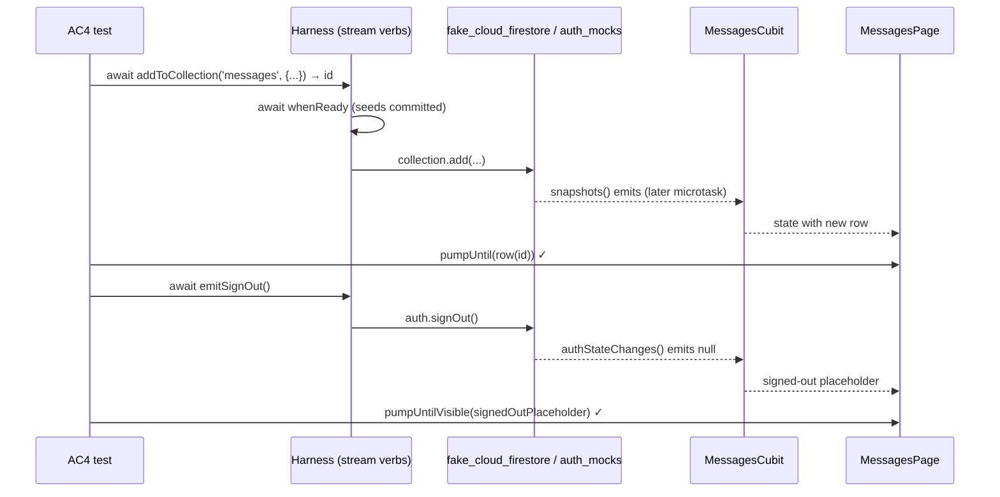

## ✨ feat: simulate Firebase streams (Firestore snapshots + Auth state) - Standard

## Overview

Add first-class simulation of live Firebase streams to the cascade harness:
post-build **emit verbs** that drive Firestore `.snapshots()` listeners and
`authStateChanges()` mid-test, plus a reactive **`messages`** demo feature and
an acceptance test (**AC4**) that prove the whole loop end-to-end against a
pumped `StreamBuilder`-style UI.

Today the harness only seeds *initial* state (`withCollection`, `withDocument`,
`withSignedInUser`). The underlying fakes already stream — verified from
source: `fake_cloud_firestore` 4.1.1 emits a snapshot on every write, and
`firebase_auth_mocks` 0.15.2 exposes a broadcast `authStateChanges()` — but
three gaps make streaming unproven and un-ergonomic:

1. No post-build "emit" verb exists on the harness.
2. `TestApp.build()` discards the built `Harness`, so a test can't push
   updates after `pumpWidget` ([test_app.dart:34-42](packages/demo_dio_firebase/test/support/test_app.dart#L34-L42)).
3. No demo feature or test drives a live snapshot listener.

Source: [brainstorm doc](../brainstorm/2026-07-12-simulate-firebase-streams-brainstorm-doc.md).

## Problem Statement / Motivation

Reactive Flutter UIs are built on Firestore snapshots and auth-state streams.
A harness that can only seed initial state cannot acceptance-test the most
common real-world screen: a live list that updates when the backend changes,
or a UI that reacts to sign-out. Users must reach into the raw fakes by hand,
which is undiscoverable and breaks the harness's "named, awaitable verbs"
ergonomics (R3.1). Closing this gap keeps the harness honest about what it can
prove and documents streaming by example, the same way AC1/AC3 document the
request/response surface.

## Proposed Solution

Thin, awaitable emit verbs on `Harness` (a `cascade_firebase` extension),
symmetric with the existing `withX` seed verbs; expose the built `Harness`
from both demos' `TestApp`s; add one reactive `messages` feature to
`demo_dio_firebase`; prove it with a new AC4 acceptance test driven by the
chainable robot DSL, keys-only.

### Layer B — new emit verbs (`packages/cascade_firebase/lib/src/stream_verbs.dart`, new file)

```dart
/// Post-build emit verbs that drive the live fakes (extension on Harness).
extension FirebaseStreamVerbs on Harness {
  /// Sets (upserts) the document at [path]; live snapshots emit.
  Future<void> pushDocument(String path, Map<String, dynamic> data);

  /// Updates the existing document at [path]; throws (via the fake,
  /// mirroring real Firestore) when the document does not exist.
  Future<void> updateDocument(String path, Map<String, dynamic> data);

  /// Deletes the document at [path]; live snapshots emit the removal.
  Future<void> deleteDocument(String path);

  /// Adds an auto-id document to the collection at [path].
  /// Returns the new document id so keys-only tests can await the row.
  Future<String> addToCollection(String path, Map<String, dynamic> data);

  /// Signs in mid-test and emits on authStateChanges().
  /// Implementation: `auth.mockUser = buildMockUser(...)` then
  /// `auth.signInWithCredential(null)` (verified against
  /// firebase_auth_mocks 0.15.2 source).
  Future<void> emitSignIn({String uid, String? email, Map<String, dynamic> claims});

  /// Signs out mid-test; authStateChanges() emits null.
  Future<void> emitSignOut();
}
```

Design rules baked into every verb (from flow analysis):

- **Await `whenReady` first.** Each verb internally awaits `harness.whenReady`
  before touching the fake, so an emit can never interleave with still-pending
  seed writes (removes a whole race class; one line per verb).
- **`Future`-returning and awaited.** Writes commit on a later microtask (the
  review-I1 / `buildHarnessAsync` timing lesson). Tests `await` the verb, then
  `pumpUntil` the UI change — never `pumpAndSettle`.
- **Path-shape validation.** `pushDocument`/`updateDocument`/`deleteDocument`
  require an even segment count (document path); `addToCollection` requires an
  odd count (collection path). Violations throw an `ArgumentError` naming the
  verb, instead of failing deep inside the fake.
- **`updateDocument` ≠ `pushDocument`.** `updateDocument` delegates to
  `update()` and propagates the fake's not-found error (honest, mirrors real
  Firestore); `pushDocument` is the upsert (`set()`).
- **Auth verbs delegate raw to the fake.** Duplicate `emitSignOut()` emits
  `null` again; `emitSignIn` for an already-signed-in user is a new sign-in
  (claims are constructor-only on `MockUser`, so mid-test claim changes are a
  fresh sign-in — documented on the verb). Behavior pinned by unit tests.

Export the new file from [cascade_firebase.dart](packages/cascade_firebase/lib/cascade_firebase.dart).

### Layer A — `pumpUntilAbsent` (`packages/cascade_core`)

`pumpUntil` waits for a finder to *appear*; nothing waits for disappearance.
Deletion and sign-out both land on a later microtask, so asserting "row gone" /
"list gone" needs the inverse primitive:

- `WidgetTesterX.pumpUntilAbsent(Finder, {timeout, step})` in
  [widget_tester_x.dart](packages/cascade_core/lib/src/tester/widget_tester_x.dart)
  (mirror image of `pumpUntil`, [widget_tester_x.dart:29-44](packages/cascade_core/lib/src/tester/widget_tester_x.dart#L29-L44)).
- A matching chainable `pumpUntilGone(Key)` verb on `Robot`
  ([robot.dart](packages/cascade_core/lib/src/robot/robot.dart)), alongside the
  existing `pumpUntilVisible`.

This is transport-free tester vocabulary, so it belongs in `cascade_core`
without violating AC5.

### Expose the built `Harness` from `TestApp` (both demos)

In [demo_dio_firebase test_app.dart](packages/demo_dio_firebase/test/support/test_app.dart)
and [demo_http test_app.dart](packages/demo_http/test/support/test_app.dart):
store the harness during `build()` and expose it via a getter with a
descriptive failure mode (a bare `late final` would throw an opaque
`LateInitializationError` when accessed pre-build):

```dart
Harness? _harness;

/// The harness built by [build]. Throws a descriptive StateError when
/// accessed before build().
Harness get harness {
  final h = _harness;
  if (h == null) {
    throw StateError('TestApp.harness accessed before build(). '
        'Call pumpWidget(app.build()) first.');
  }
  return h;
}

Widget build() {
  final harness = _harness = buildHarness();
  // ... unchanged
}
```

`build()` called twice replaces the harness (last build wins) — matches how a
test would re-pump; documented on the getter.

### Layer C — the `messages` demo feature (`packages/demo_dio_firebase`)

A chat-like live list — the canonical `.snapshots()` example (resolves the
brainstorm's open question in favor of `messages`).

New files:

- `lib/features/messages/messages_cubit.dart` — subscribes to
  `firestore.collection('messages').snapshots()` **and**
  `auth.authStateChanges()`. Initial auth state is read from
  `auth.currentUser` (hard requirement: `authStateChanges()` is broadcast with
  **no replay** to late listeners — verified from firebase_auth_mocks source —
  so a stream-only gate would render signed-out forever). Cancels both
  `StreamSubscription`s in `close()` (leaked-async failures otherwise). On
  sign-out the state flips to signed-out; on re-sign-in it resubscribes and
  re-renders the current collection state.
- `lib/features/messages/messages_keys.dart` — keys for every asserted state:
  `list`, `emptyState`, `signedOutPlaceholder`, and `row(String id)` →
  `ValueKey('message_$id')`. (You cannot `pumpUntil` "nothing" — empty,
  populated, and gated each need their own key.)
- `lib/features/messages/messages_page.dart` — renders the keyed list /
  empty state / signed-out placeholder from the cubit state; follows the
  existing feature-page pattern
  ([profile_page.dart](packages/demo_dio_firebase/lib/features/profile/profile_page.dart)).

Wire `MessagesPage(firestore: firestore, auth: auth)` into `_HomePage` in
[app.dart:79-96](packages/demo_dio_firebase/lib/app/app.dart#L79-L96), behind
the existing login gate. **Auth-reactivity lives inside the messages feature**
(the signed-out placeholder), not in a new top-level gate — the top gate stays
the local `LoginCubit` (resolves the second open question without duplicating
the gate).

Existing one-shot features (`policies`, `profile`, `orders`) stay unchanged.
Note: `ProfileCubit` reads `auth.currentUser` once
([profile_cubit.dart:45](packages/demo_dio_firebase/lib/features/profile/profile_cubit.dart#L45)),
so after `emitSignOut()` the profile intentionally keeps showing stale data —
expected, out of scope, and no test asserts against it.

### AC4 acceptance test + robot

- `test/robots/messages_robot.dart` (new) — **demo_dio_firebase-only**, NOT
  exported from `robots.dart`. The parity test byte-locks `login_robot.dart`,
  `orders_robot.dart` **and `robots.dart`**
  ([robots_parity_test.dart:8-12](packages/demo_http/test/robots_parity_test.dart#L8-L12)),
  so AC4 imports the robot directly — same precedent as
  [profile_robot.dart](packages/demo_dio_firebase/test/robots/profile_robot.dart).
- `test/acceptance/ac4_live_streams_test.dart` (new) — the flow, chainable DSL,
  keys-only (chains split only where a verb's return value is captured):

```dart
final app = TestApp()
  ..withSignedInUser(uid: 'u1')
  ..withCollection('messages', Fixtures.messages); // 2 seeded rows

await tester.pumpWidget(app.build());

final login = LoginRobot(tester);
final messages = MessagesRobot(tester);

// Chain 1: login gate + seeded rows render live.
await login.login()
    .on(messages)
    .expectRow('m1')
    .expectRow('m2')
    .run();

// Mid-test push — awaited verb returns the new id (keys-only needs it).
final id = await app.harness.addToCollection('messages', {'text': 'hi'});

// Chain 2: list grew, delete emits removal, sign-out gates, sign-in restores.
await messages
    .pumpUntilRow(id)                      // pumpUntil ValueKey('message_$id')
    .expectRow(id)
    .step('deleteDocument(messages/m1)',
        () => app.harness.deleteDocument('messages/m1'))
    .pumpUntilRowGone('m1')                // pumpUntilAbsent
    .step('emitSignOut', () => app.harness.emitSignOut())
    .pumpUntilVisible(MessagesKeys.signedOutPlaceholder)
    .expectVisible(AppKeys.homePage)       // LoginCubit gate untouched
    .step('emitSignIn(u1)', () => app.harness.emitSignIn(uid: 'u1'))
    .pumpUntilRow('m2')                    // resubscribed; list restored
    .run();
```

- Add `Fixtures.messages` to
  [fixtures.dart](packages/demo_dio_firebase/test/support/fixtures.dart) with
  explicit `id` fields (`m1`, `m2`) so row keys are deterministic.

### Flow diagram



## Technical Considerations

- **Architecture / AC5 isolation.** New verbs live in `cascade_firebase`
  (Layer B) and delegate to the fakes; `cascade_core` gains only
  transport-free tester vocabulary (`pumpUntilAbsent`); reactive UI/keys/robot
  live in the demo (Layer C). The forbidden-imports tests
  (`no_forbidden_imports_test.dart` in each package) must stay green.
- **Async emit timing.** Every verb is awaitable; tests `await` then
  `pumpUntil`/`pumpUntilAbsent`. No `pumpAndSettle` anywhere (repeating-timer
  apps hang it).
- **Broadcast-stream nuance.** `authStateChanges()` does not replay the
  current user to late listeners — initial state must come from
  `auth.currentUser`. Pinned by a Layer C cubit test ("seeded signed-in user
  shows list without any auth emission").
- **Two independent auth axes in AC4.** The top gate is the local `LoginCubit`
  (driven by the robot); the messages gate is Firebase auth (driven by
  `emitSignIn`/`emitSignOut`). `emitSignOut()` does **not** return the app to
  the login page — the correct post-sign-out assertion is
  `signedOutPlaceholder` visible **and** `home_page` still visible.
- **Subscription hygiene.** `MessagesCubit.close()` cancels both
  subscriptions, or widget tests fail with pending-timer/leaked-async errors.
- **Performance / security.** Test-only surface; no production code paths
  change beyond adding the demo feature. No security implications.

## Acceptance Criteria

Functional (from brainstorm AC-S1..S5, sharpened by flow analysis):

- [ ] **AC-S1** — A harness verb pushes a Firestore doc post-build and a live
      `.snapshots()` listener in the pumped app receives it (AC4: list grows
      mid-test).
- [ ] **AC-S1a** — `addToCollection` returns the new document id, and AC4 uses
      it to derive the row key (keys-only).
- [ ] **AC-S2** — `emitSignOut()` drives `authStateChanges()` and the reactive
      UI responds mid-test: `MessagesKeys.signedOutPlaceholder` becomes
      visible while `AppKeys.homePage` remains visible.
- [ ] **AC-S2b** — `emitSignIn()` after sign-out resubscribes and restores the
      list (AC4 asserts a pre-existing row reappears).
- [ ] **AC-S3** — All six verbs have `cascade_firebase` unit tests (emit → the
      fake's stream emits the expected snapshot/auth event), and AC4 is green.
- [ ] **AC-S3a** — Unit tests additionally cover: `updateDocument` on a
      missing doc propagates the not-found error; `deleteDocument` emits the
      removal; duplicate `emitSignOut()`; verbs await `whenReady` before
      writing (no seed/emit interleaving).
- [ ] **AC-S4** — Robot parity stays green: `messages_robot.dart` exists only
      in `demo_dio_firebase` and is not exported from `robots.dart`.
- [ ] **AC-S5** — `dart analyze` clean; all verbs awaitable; tests use
      `pumpUntil`/`pumpUntilAbsent`, never `pumpAndSettle`.
- [ ] **AC-S5a** — `TestApp.harness` accessed before `build()` throws a
      descriptive `StateError` (unit-tested); malformed paths throw
      `ArgumentError` naming the verb (unit-tested).
- [ ] Cubit test pins the no-replay nuance: seeded signed-in user renders the
      list with zero auth emissions; `close()` cancels subscriptions.
- [ ] Empty-list transition covered (push into an empty collection → first row
      appears) — a different StreamBuilder transition than list-grows; cubit
      or widget-level test is sufficient.

## Success Metrics

- AC4 passes deterministically (no flaky `pumpUntil` timeouts) alongside
  AC1–AC3 in the full suite.
- A streaming test reads as a plain robot chain with named harness verbs — no
  raw `harness.firestore.doc(...).set(...)` reach-ins needed.
- Zero changes to existing features or acceptance tests (AC1/AC2/AC3
  untouched and green).

## Dependencies & Risks

| Risk | Mitigation |
| --- | --- |
| Parity test breaks if the new robot touches the byte-locked set | `messages_robot.dart` never enters `robots.dart`; AC4 imports it directly (profile_robot precedent) |
| Emit races seeded writes → nondeterministic row order | Verbs internally `await whenReady` before writing |
| Stream-only auth gate renders signed-out forever (no replay) | Cubit reads `currentUser` for initial state; pinned by test |
| Leaked subscriptions fail widget tests | `close()` cancels both subscriptions; covered by cubit test |
| `late final` harness gives an opaque pre-build error | Getter with descriptive `StateError` instead |
| Capturing `addToCollection`'s id splits the fluent chain | Accepted: two `.run()` chains around one `await`; emit verbs that return nothing stay in-chain via `step()` |
| `fake_cloud_firestore`/`firebase_auth_mocks` API drift | Behavior verified from the exact cached versions (4.1.1 / 0.15.2); Layer B unit tests pin it |

No external/API dependencies; no schema or backend changes.

## Implementation Suggestions

Suggested order (each step leaves the suite green):

1. **`cascade_core`**: `pumpUntilAbsent` on `WidgetTesterX` + `pumpUntilGone`
   robot verb, with tests
   (`packages/cascade_core/test/tester/widget_tester_x_test.dart`,
   `packages/cascade_core/test/robot/robot_test.dart`).
2. **`cascade_firebase`**: `lib/src/stream_verbs.dart` + barrel export +
   `test/stream_verbs_test.dart` (all verbs; error paths; `whenReady`
   ordering; auth emission behavior).
3. **TestApp harness exposure** in both demos (+ pre-build `StateError` test).
4. **Messages feature**: cubit → keys → page → wire into `app.dart`; cubit
   tests (initial state, live update, sign-out/in, `close()`).
5. **AC4**: `Fixtures.messages`, `messages_robot.dart`, `ac4_live_streams_test.dart`.
6. Full suite + `dart analyze` (run tests via the very_good_cli MCP test tool —
   a committed hook blocks `flutter test`/`dart test` in this repo).

## Non-Goals (YAGNI)

- No `SnapshotDriver`/batching object.
- No HTTP/SSE streaming (needs a new streaming registry outcome type — a
  separate, larger effort).
- No storage-stream or callable-stream (`HttpsCallable.stream()`) simulation.
- No conversion of existing one-shot features to streams; profile's
  stale-after-sign-out read is expected and untested-against.

## References & Research

- Brainstorm: [2026-07-12-simulate-firebase-streams-brainstorm-doc.md](../brainstorm/2026-07-12-simulate-firebase-streams-brainstorm-doc.md)
- Seed-verb pattern to mirror: [firebase_installer.dart:71-99](packages/cascade_firebase/lib/src/firebase_installer.dart#L71-L99)
- Harness container & `whenReady`: [transport_installer.dart:22-67](packages/cascade_core/lib/src/builder/transport_installer.dart#L22-L67)
- Chain/robot style to follow: [ac1_full_flow_test.dart:32-53](packages/demo_dio_firebase/test/acceptance/ac1_full_flow_test.dart#L32-L53)
- Demo-only robot precedent: [profile_robot.dart:5-6](packages/demo_dio_firebase/test/robots/profile_robot.dart#L5-L6)
- Byte-locked parity set: [robots_parity_test.dart:8-12](packages/demo_http/test/robots_parity_test.dart#L8-L12)
- `firebase_auth_mocks` 0.15.2 source (no-replay broadcast streams; `signOut()`
  emits null; `mockUser` setter + `signInWithCredential(null)` for mid-test
  sign-in): `~/.pub-cache/hosted/pub.dev/firebase_auth_mocks-0.15.2/lib/src/firebase_auth_mocks_base.dart`
- `fake_cloud_firestore` 4.1.1 source (snapshot stream controllers emit on
  writes): `~/.pub-cache/hosted/pub.dev/fake_cloud_firestore-4.1.1/lib/src/mock_collection_reference.dart`
