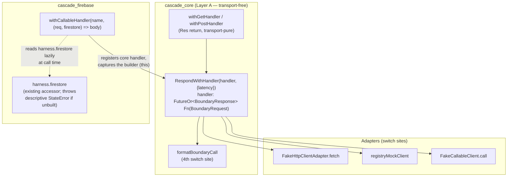

# ✨ feat: handler-based stub outcome (CR-1)

Add a third `StubOutcome` leaf — **`RespondWithHandler`** — that computes its
response from the matched `BoundaryRequest` at call time, so a stub can model a
call whose **server side-effect the client reads back**. The motivating case is
`createOffer`: a callable that must return `{offerId}` *and* atomically write
`offers/{offerId}` to the fake Firestore, where the id is chosen server-side.

> Derived from the [2026-07-13 brainstorm](../brainstorm/2026-07-13-handler-based-stub-outcome-brainstorm-doc.md).
> **One correction from flow analysis:** the sealed leaf forces **four** switch
> sites, not three — `formatBoundaryCall` in the boundary log is the fourth.

---

## Background & Motivation

Every outcome today is static:

- `RespondWith(BoundaryResponse)` / `FailWith(BoundaryError)` in
  [stub.dart](../../packages/cascade_core/lib/src/registry/stub.dart).
- The `withCallable` / `withGet` / `withPost` verbs all bake a fixed body at
  **config time** ([test_harness_builder.dart:136](../../packages/cascade_core/lib/src/builder/test_harness_builder.dart#L136),
  [firebase_installer.dart:56](../../packages/cascade_firebase/lib/src/firebase_installer.dart#L56)).

That cannot express a response that depends on the *request* or on
*server-generated state*. `createOffer` needs the stub to (1) choose an id, (2)
write `offers/{id}` to Firestore, and (3) return `{offerId: id}` — then the app
reads the freshly written doc back.

Because `StubOutcome` is `sealed`, adding a leaf is a compiler-checked change: no
switch site can be silently missed. The registry, sequencing (`Stub.next`),
latency, recording, and fail-fast are all untouched — a handler is just one more
outcome in an outcome list.

### Stakeholders

- **Test authors** (primary "users"): gain `withCallableHandler` /
  `withGetHandler` / `withPostHandler` to model dynamic, side-effecting boundary
  responses.
- **Harness maintainers**: absorb a sealed-type extension across four switch
  sites and a late-bind wiring in `cascade_firebase`.

---

## Chosen Approach

The sealed leaf is the design *given* — the minimal, type-safe way to extend the
outcome model. The forks are resolved toward the **smallest core surface that
respects the package boundary**:

- **Core `RespondWithHandler` stays transport- and Firebase-agnostic.** It
  receives a `BoundaryRequest`, returns a `BoundaryResponse`, and knows nothing
  about Firestore. `cascade_core` (Layer A) stays transport-free.
- **Firestore access is reconciled entirely inside `cascade_firebase`** by
  late-binding through the **existing `harness.firestore` accessor** — no new
  context concept and no new state leak into core (see Key Decision #6).
- **The verb set ships symmetric** (callable + HTTP handler verbs) because the
  sealed change already forces every switch site.

### Rejected alternatives (YAGNI, from brainstorm)

| Alternative | Why rejected |
| --- | --- |
| Explicit `HandlerContext` threaded adapter → core | Forces `cascade_core` to carry a context type meaningful only to the Firebase transport — machinery for no extra capability. |
| `FutureOr<StubOutcome>` return (handler decides respond-vs-fail) | `createOffer` needs only the success path; non-2xx is already a `BoundaryResponse`. A callable that must *throw* dynamically is a later ask. |
| Auth/Storage handles passed to the handler | Only Firestore is needed for the P0 case. Additive later. |

---

## Key Decisions (resolved open questions)

| # | Question (from brainstorm) | Decision |
| --- | --- | --- |
| 1 | HTTP handler return: `Res` vs `BoundaryResponse` | **`Res`** — surface symmetry with `withGet`/`withPost`. The core leaf speaks `BoundaryResponse`; the verb maps `Res → BoundaryResponse` exactly as `_registerHttp` does. *Limitation:* `Res` has no `headers`, so header-computing handlers must drop to the `withStub` escape hatch (documented, see Risk R7). |
| 2 | `withCallableHandler` generics | **Non-generic** — takes an `Object?`-returning fn like `withCallable`; the `as T` cast already lives in `FakeCallableClient.call<T>`. |
| 3 | Demo feature shape | **New `offers` feature.** App reads the written doc via a **one-shot `get()`** (parity with `ProfileCubit.load`), keeping this effort disentangled from the separate streams work. |
| 4 | Switch-site style (dio/http) | **`switch` statement** — the cleanest way to `await handler(request)` **once** before building the transport response. |
| 5 | Handler-in-sequence surface | **`withStub` escape hatch** — no new handler-sequence verb. `withStub(Stub(matcher, outcomes: [RespondWith(...), RespondWithHandler(...)]))` is the existing first-class way to build arbitrary sequences (satisfies CR1-S4). |
| 6 | Firestore late-bind mechanism | **Reuse the existing `harness.firestore` accessor** (simplicity review). `withCallableHandler` is an extension method on `TestHarnessBuilder`, so it captures `this` (the builder) and reads `harness.firestore` **lazily at call time**. No new `_FirebaseConfig` field, no bespoke null-check: `harness.firestore` → `Harness.get<FakeFirebaseFirestore>()` already throws a descriptive `StateError` ("No FakeFirebaseFirestore installed on the harness. Call the matching use*/with* verb before build.") when `useFirebase()` was not called — satisfying CR1-S5 with the standard harness message. Verb order stays irrelevant, and the Expando GC hazard disappears (no new field to keep alive). |

---

## Architecture



**The four switch sites over `StubOutcome`** (each gains a `RespondWithHandler`
arm; compiler enforces completeness):

1. [callable_client.dart:67](../../packages/cascade_firebase/lib/src/callable_client.dart#L67) — `FakeCallableClient.call` (single-expression arm OK)
2. [fake_http_client_adapter.dart:32](../../packages/cascade_dio/lib/src/fake_http_client_adapter.dart#L32) — `FakeHttpClientAdapter.fetch` (→ statement, single await)
3. [registry_mock_client.dart:17](../../packages/cascade_http/lib/src/registry_mock_client.dart#L17) — `registryMockClient` (→ statement, single await)
4. [boundary_log.dart:10](../../packages/cascade_core/lib/src/observability/boundary_log.dart#L10) — `formatBoundaryCall` **(the missed fourth site)**

---

## Implementation Plan

### Phase 1 — Core leaf + boundary-log arm (`cascade_core`)

**Files:** [stub.dart](../../packages/cascade_core/lib/src/registry/stub.dart),
[boundary_log.dart](../../packages/cascade_core/lib/src/observability/boundary_log.dart)

1. Add the leaf to `stub.dart`:

   ```dart
   // stub.dart — new imports: 'dart:async', boundary_request, boundary_response
   /// Computes its response from the matched request at call time (CR-1).
   ///
   /// Unlike [RespondWith], the body is not baked at config time: the adapter
   /// awaits [handler] once, after the outcome's latency, and delivers its
   /// [BoundaryResponse]. Slots into sequences and honors [latency] like any
   /// other [StubOutcome].
   final class RespondWithHandler extends StubOutcome {
     const RespondWithHandler(this.handler, {super.latency});
     final FutureOr<BoundaryResponse> Function(BoundaryRequest request) handler;
   }
   ```

2. Add the fourth-site arm to `formatBoundaryCall`. The log runs at
   `resolve()` time — **before** the handler executes (see Risk R2) — so it has
   no status/body yet. Render a static marker:

   ```dart
   RespondWithHandler() => 'handler',
   // → '[boundary] CALL createOffer -> handler (5ms)'
   ```

### Phase 2 — HTTP handler verbs (`cascade_core`, transport-pure)

**File:** [test_harness_builder.dart](../../packages/cascade_core/lib/src/builder/test_harness_builder.dart)

3. Add `withGetHandler` / `withPostHandler`. Each registers a single
   `RespondWithHandler` whose closure maps the request-derived `Res → BoundaryResponse`:

   ```dart
   /// Stubs a `GET` [path] whose response is computed from the request (CR-1).
   void withGetHandler(
     String path,
     FutureOr<Res> Function(BoundaryRequest request) handler, {
     Map<String, dynamic>? query,
     Duration? latency,
   }) => _registerHandler('GET', path, handler, query: query, latency: latency);

   void withPostHandler(...) => _registerHandler('POST', path, handler, latency: latency);

   // Type the fn parameter explicitly — an inferred `dynamic` trips
   // very_good_analysis strict-inference/strict-raw-types.
   void _registerHandler(
     String method,
     String path,
     FutureOr<Res> Function(BoundaryRequest request) handler, {
     Map<String, dynamic>? query,
     Duration? latency,
   }) {
     registry.register(Stub(
       matcher: RequestMatcher(method, path, query: query),
       outcomes: [RespondWithHandler(
         (request) async {
           final res = await handler(request);
           // NOTE: only statusCode + data round-trip. `Res.latency` is spent by
           // the outer `latency:` before the handler runs, and `Res` has no
           // headers (Risk R7) — document both on the verb doc-comments.
           return BoundaryResponse(statusCode: res.statusCode, body: res.data);
         },
         latency: latency,
       )],
     ));
   }
   ```

   Match parity: `withGetHandler` accepts `query:` (mirrors `withGet`); a handler
   can also read `request.query` inside its body. Doc-comments must state the
   JSON-encodable body contract (Risk R8) and the `Res.latency`/headers no-round-trip.

### Phase 3 — callable verb via the existing `harness.firestore` accessor (`cascade_firebase`)

**File:** [firebase_installer.dart](../../packages/cascade_firebase/lib/src/firebase_installer.dart)

> Simplification (Key Decision #6): **no `_FirebaseConfig` change.** `useFirebase`
> already `put<FakeFirebaseFirestore>` on the harness
> ([firebase_installer.dart:37](../../packages/cascade_firebase/lib/src/firebase_installer.dart#L37)),
> and `harness.firestore` already throws a descriptive `StateError` when it was
> not installed. The verb reuses that path.

4. Add `withCallableHandler`. It **captures `this` (the builder)** and reads
   `harness.firestore` lazily at call time — after build, so the instance is
   present; before/without `useFirebase()`, the accessor's own `StateError`
   surfaces (satisfies CR1-S5):

   ```dart
   /// Stubs the callable [name] to compute its body from the request and the
   /// built fake Firestore (CR-1). Requires [useFirebase]; verb order is free.
   ///
   /// The handler body runs during the test (post-build): reading
   /// `harness.firestore` resolves the installed fake, or throws a descriptive
   /// `StateError` if `useFirebase()` never ran.
   void withCallableHandler(
     String name,
     FutureOr<Object?> Function(BoundaryRequest request, FakeFirebaseFirestore firestore) handler,
   ) {
     registry.register(Stub(
       matcher: RequestMatcher('CALL', name),
       outcomes: [RespondWithHandler((request) async {
         final firestore = harness.firestore; // late-bind via existing accessor
         final body = await handler(request, firestore);
         return BoundaryResponse(statusCode: 200, body: body);
       })],
     ));
   }
   ```

### Phase 4 — Adapter switch arms (single-invocation guarantee)

**Files:** [fake_http_client_adapter.dart](../../packages/cascade_dio/lib/src/fake_http_client_adapter.dart),
[registry_mock_client.dart](../../packages/cascade_http/lib/src/registry_mock_client.dart),
[callable_client.dart](../../packages/cascade_firebase/lib/src/callable_client.dart)

5. **dio** & **http**: convert the `switch` **expression** to a `switch`
   **statement** so the handler is awaited exactly **once** before the response
   is built (today the expression references `response` twice —
   `jsonEncode(body)` + `statusCode`). Sketch (dio):

   ```dart
   switch (resolved.outcome) {
     case RespondWith(:final response):
       return _toResponseBody(response);
     case RespondWithHandler(:final handler):
       final response = await handler(request); // ← awaited once
       return _toResponseBody(response);
     case FailWith(:final error):
       throw _toDioException(error, options);
   }
   ```

   `registry_mock_client` additionally binds the mapped request first so it can
   be passed to the handler: `final boundaryRequest = _mapRequest(request);`.

6. **callable**: single-expression arm is fine:

   ```dart
   RespondWithHandler(:final handler) =>
     (await handler(request)).body as T,
   ```

### Phase 5 — `createOffer` demo feature + acceptance proof (`demo_dio_firebase`)

**New files:**
`packages/demo_dio_firebase/lib/features/offers/offers_cubit.dart`,
`offers_page.dart`, `offers_keys.dart`;
`packages/demo_dio_firebase/test/robots/offers_robot.dart`;
`packages/demo_dio_firebase/test/acceptance/ac5_handler_outcome_test.dart`.
**Edits:** wire `OffersPage` into [app.dart](../../packages/demo_dio_firebase/lib/app/app.dart)'s `_HomePage`.
**Do NOT** export `offers_robot` from `robots.dart` — that barrel is only for the
shared, cross-demo (dio+http) AC3 robots (`login`, `orders`). `offers_robot` is
Firebase-only/demo-specific, so import it **directly** in the acceptance test,
matching the `profile_robot`/`messages_robot` convention (VGV review #2).

7. `OffersCubit` — model on **`OrdersCubit`/`OrdersState`** (status-enum), not
   `ProfileState`, so loading/failure are representable (VGV review #1). An
   `OffersState { OffersStatus status; String offerId; String title; String error }`;
   `createOffer()` emits `loading`, calls
   `callableClient.call<Map<String, dynamic>>('createOffer')`, reads back
   `offers/{offerId}` via a one-shot `firestore.doc(...).get()`, emits `success`
   with the read-back title — and wraps the callable in
   `try/on FirebaseFunctionsException` to emit `failure` (parity with
   `OrdersCubit.submit`). `OffersPage` renders a button + result text + an error
   text keyed by `OffersKeys` (include `OffersKeys.error`).

8. Acceptance test wires:

   ```dart
   final app = TestApp()
     ..withSignedInUser(uid: 'u1')
     ..withCallableHandler('createOffer', (request, firestore) async {
       const id = 'offer-1';                 // server-chosen id
       await firestore.doc('offers/$id').set({'title': 'Hello'}); // MUST await
       return {'offerId': id};
     });
   ```

   Then drive the app: tap → `pumpUntil` the offer title read back from the doc.
   **Never assert synchronously against Firestore after the call** (Risk R2).

---

## Test Plan

Test runner note: this repo blocks `flutter test`/`dart test` via a hook — use
the **very_good_cli MCP test tool** to run suites.

| ID | Coverage | File |
| --- | --- | --- |
| CR1-S1 | `withCallableHandler` computes id, writes `offers/{id}`, returns `{offerId}`; app reads the doc back | `demo_dio_firebase/test/acceptance/ac5_handler_outcome_test.dart` |
| CR1-S2 | All four sites compile; handler invoked **exactly once** per resolution (observable side-effect counter, per adapter) | `cascade_dio/test/fake_http_client_adapter_test.dart`, `cascade_http/test/registry_mock_client_test.dart`, `cascade_firebase/test/fake_callable_client_test.dart` |
| CR1-S3 | `withGetHandler`/`withPostHandler` compute a response from the request (echo a path/query param) | `cascade_core/test/builder/test_harness_builder_test.dart` |
| CR1-S4 | Handler participates in a sequence (`[RespondWith, handler]` via `withStub`) and honors per-outcome latency | `cascade_core/test/registry/stub_registry_test.dart` |
| CR1-S5 | `withCallableHandler` without `useFirebase()` throws a descriptive `StateError` — asserted **at the boundary** (`harness.callableClient.call(...)`), not through the app (Risk R3) | `cascade_firebase/test/firebase_installer_test.dart` |
| — | New-leaf unit test: `RespondWithHandler` construction, latency inheritance, `formatBoundaryCall` renders `handler` | `cascade_core/test/registry/stub_registry_test.dart`, `cascade_core/test/observability/boundary_log_test.dart` |
| CR1-S6 | `dart analyze` clean across all touched packages; existing suites (incl. `demo_http` robot parity, `no_forbidden_imports_test`) stay green | (all packages) |

---

## Success Criteria

- [ ] **CR1-S1** — `createOffer` handler writes `offers/{id}`, returns `{offerId}`; the app reads the doc back. Proven by a `demo_dio_firebase` acceptance test.
- [ ] **CR1-S2** — All **four** switch sites compile against the sealed leaf; each adapter invokes the handler **exactly once** per resolution (side-effect counter asserts 1).
- [ ] **CR1-S3** — `withGetHandler`/`withPostHandler` compute a response from the request (`cascade_core` unit tests).
- [ ] **CR1-S4** — A handler participates in a `[RespondWith, handler]` sequence and honors per-outcome latency (`cascade_core` unit test, via `withStub`).
- [ ] **CR1-S5** — `withCallableHandler` without `useFirebase()` throws a descriptive `StateError`, observed directly at the boundary.
- [ ] **CR1-S6** — `dart analyze` clean across touched packages; existing tests stay green.

---

## Constraints, Risks & Edge Cases

Risks **R1–R4** are from the brainstorm; **R6–R11** were surfaced by flow
analysis and folded into the plan above. **R5 was removed** — the accessor-reuse
simplification (Key Decision #6) eliminates the Expando GC hazard entirely.

| ID | Risk / edge case | Mitigation (where handled) |
| --- | --- | --- |
| R1 | `FutureOr` import: `stub.dart` gains `dart:async` + `boundary_request`/`boundary_response` imports | Phase 1 |
| R2 | **Async timing.** Handler is awaited *after* latency; Firestore writes commit on a later microtask. | Acceptance test reads the doc back through the app and `pumpUntil`s the UI — never asserts synchronously post-call (Phase 5). |
| R3 | **Misuse `StateError` reachability.** The "no `useFirebase()`" `StateError` is raised at call time inside the callable arm. It is a `StateError`, **not** a `FirebaseFunctionsException`, so a `ProfileCubit`/`OffersCubit`-style `on FirebaseFunctionsException catch` lets it **propagate** (not swallow). In practice `TestApp` always calls `useFirebase()` in its constructor, so the app path is largely unreachable anyway. | CR1-S5 asserts the misuse **at the boundary** on a bare builder (`harness.callableClient.call('createOffer')` without `useFirebase()`), where the accessor's `StateError` surfaces directly to the test. |
| R6 | **Handler must await its own writes.** A single adapter await only guarantees commit-before-response if the handler awaits `.set()` internally. | Documented as the handler contract; CR1-S1 handler awaits (Phase 5). |
| R7 | **`Res` has no headers, and `Res.latency` does not round-trip.** `withGetHandler`/`withPostHandler` can't compute response headers, and a `Res(..., latency:)` returned *inside* a handler is a silent no-op. | Documented on the verb doc-comments (Phase 2); header/latency-computing handlers use the `withStub` escape hatch returning a raw `RespondWithHandler`. |
| R8 | **HTTP handler bodies must be JSON-encodable.** dio/http arms `jsonEncode(body)`; a handler returning raw Firestore types (`Timestamp`, `DocumentReference`) throws in `fetch`. (Callable arm does no encode.) | Document the JSON-encodable contract on the HTTP verbs' doc comments. `createOffer`'s `{offerId: String}` over callable is safe. |
| R11 | **`as T` cast on the callable wrapper.** Non-generic `Object?` + `body as T` throws if the app requests a narrower `T` than the handler produces. | Inherited from `withCallable`, not introduced; documented on the verb. |

**Verified, no mitigation needed** (design-review artifacts, no implementer action):
_R4_ recording parity — `recorder.record()` runs in `resolve()` before the handler, so `expectCalled*` sees handler calls identically (confirmed by CR1-S2).
_R9_ a throwing handler still consumes its sequence slot and is recorded (cursor advances + record happen in `resolve()`, before the handler runs) — intended semantics; state it in the leaf doc-comment.
_R10_ layer isolation holds (core transport-free, Firestore knowledge in `cascade_firebase`) — enforced by each package's `no_forbidden_imports_test` (CR1-S6).

---

## Non-Goals (YAGNI)

- No `HandlerContext` type in core.
- No `FutureOr<StubOutcome>` return / dynamic fail-from-handler (non-2xx is
  already a `BoundaryResponse`; a callable that must *throw* dynamically is a
  later, separate ask).
- No Auth/Storage handles to the handler — Firestore only, per the P0 case.
- No streaming / handler-per-emission interaction (separate streams effort).
- No new handler-sequence verb (the `withStub` escape hatch covers it).

---

## Definition of Done

- [ ] `RespondWithHandler` leaf added; all four switch sites compile with a new arm.
- [ ] `withCallableHandler` (Firebase), `withGetHandler`/`withPostHandler` (core) implemented and exported.
- [ ] `withCallableHandler` late-binds Firestore via the existing `harness.firestore` accessor (no new `_FirebaseConfig` state).
- [ ] `createOffer` demo feature + acceptance test prove the write-then-read-back flow.
- [ ] All six success criteria (CR1-S1…S6) pass via the very_good_cli MCP test tool.
- [ ] `dart analyze` clean; existing suites (incl. `demo_http` parity) green.
